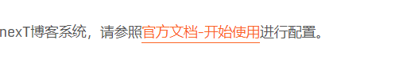

---

title: Hexo博客NexT主题配置

categories:

- 常用工具使用
- Hexo
- NexT

tags:

- Hexo
- NexT

abbrlink: af8df786

date: 2018-05-14 16:55:31

---

Hexo 是一个快速、简洁且高效的博客框架。Hexo 使用 Markdown（或其他渲染引擎）解析文章，在几秒内，即可利用靓丽的主题生成静态网页。本文中我们将对hexo中nexT主题搭建的自己的博客站点进行配置，为你打造个性化博客系统。
<!-- more -->

#### 目录 ####

1.[Hexo博客发布流程](#jump1)  
2.[新建带日期格式的博文](#jump2)  
3.[博文插入图片](#jump3)  
4.[链接持久化](#jump4)  
5.[添加分享功能(百度分享)](#jump5)  
6.[添加搜索功能](#jump6)  
7.[nexT小白必看-开始使用](#jump7)  
8.[nexT小白必看-主题配置](#jump8)  
9.[nexT小白必看-第三方服务](#jump9)  
10.[nexT进阶必看-内建标签](#jump10)  
11.[nexT进阶必看-进阶设定](#jump11)  
12.[nexT进阶必看-常见问题](#jump12)  
13.[Hexo类似平台](#jump13)  
14.[修改文章内超链接文本样式](#jump14)  

 <span id="jump1"></span>
#### 1. Hexo博客发布流程

1. hexo init (初始化一个博客系统)  
2. hexo new post "博文名称" (新增一个博文)  
3. hexo generate (编译博文)  
4. hexo server(或hexo s --debug) (本地启动进行预览)  
5. hexo deploy (发布到远程服务器上)  
	1. 站点文件.config.yml中配置git  
	```yml
	deploy:
	  - type: git
	    repo:
	      github: git@github.com:github账号/发布仓库,分支名称
	      coding: git@git.coding.net:coding账号/发布仓库,分支名称
	  - type: leancloud_counter_security_sync
	```
	2. 安装hexo-deployer-git插件  
	```
	npm install --save hexo-deployer-git
	```

<span id="jump2"></span> 
#### 2. 新建带日期格式的博文

使用hexo new post "博文名称"生成的博文以博文名称生成文件，当文件太多时不便于管理查看，生成yyyy-MM-dd-博文名称的名称有助于我们管理自己的博文。  
在站点文件_config.yml中设置博客生成名称:  

```yml
# Writing
new_post_name: :year-:month-:day-:title.md # File name of new posts  

```

重新执行hexo new post "博文名称"命令，就可以生成yyyy-MM-dd-博文名称.md类型的名称了。

<span id="jump3"></span>
#### 3. 博文插入图片

1. 配置站点文件_config.yml:  

	```yml
	post_asset_folder: true

	```

2. 安装上传本地图片的插件  

	npm install https://github.com/CodeFalling/hexo-asset-image --save

3. 执行hexo new post "xxxx"  

	在/source/_posts文件夹内除了生成xxxx.md文件还会生成一个同名的文件夹，把图片复制到同名文件夹中，在博文中添加图片：

	```yml
	
	```

<span id="jump4"></span>
#### 4. 链接持久化

在Hexo中当我们创建的博文名包含中文的名的时候，url链接地址经常会变成一串很长的难以理解的字符串，不利于博文的链接分享，以及搜索引擎搜索，我能可以让url链接持久化来解决这个问题。  

1. 安装url地址持久化插件:  

	```yml
	npm install hexo-abbrlink --save
	```

2. 配置站点文件_config.yml:  

	```yml  
	permalink: post/:abbrlink.html  
	permalink_defaults:  

	abbrlink:  
	  alg: crc32  # 算法：crc16(default) and crc32  
	  rep: hex    # 进制：dec(default) and hex  
	```

<span id="jump5"></span>
#### 5. 添加分享功能(百度分享)

配置主题文件_config.yml:  

```yml  
baidushare:  
  type: button  
```

<span id="jump6"></span>
#### 6. 添加搜索功能

1. 安装 hexo-generator-searchdb 插件  

	```
	$ npm install hexo-generator-searchdb --save
	```

2. 配置站点文件_config.yml:  

	```yml  
	# 搜索
	search:
	  path: search.xml
	  field: post
	  format: html
	  limit: 10000
	```

3. 配置主题文件_config.yml:  

	```yml  
	local_search:
	  enable: true
	```

<span id="jump7"></span>
#### 7. nexT小白必看-开始使用

如果你时刚开始搭建nexT博客系统，请参照[官方文档-开始使用](http://theme-next.iissnan.com/getting-started.html)进行配置。

<span id="jump8"></span>
#### 8. nexT小白必看-主题配置

如果你已经参照[官方文档-开始使用](http://theme-next.iissnan.com/getting-started.html)配置完成，请参照[官方文档-主题配置](http://theme-next.iissnan.com/theme-settings.html)进行配置你的主题。

<span id="jump9"></span>
#### 9. nexT小白必看-第三方服务

如果你想使用第三方插件，如在线评论、统计访客、分享博文、搜索引擎等，请参照[官方文档-第三方服务](http://theme-next.iissnan.com/third-party-services.html)进行配置你的博客。

<span id="jump10"></span>
#### 10. nexT进阶必看-内建标签

假如你已经参照nexT小白必看部分内容进行了设置，那么恭喜你，你的博客已经可以完美上线运行了，如果想继续优化你的博客，在书写博文时使用一些内建标签，请阅读[官方文档-内建标签](http://theme-next.iissnan.com/tag-plugins.html)。

<span id="jump11"></span>
#### 11. nexT进阶必看-进阶设定

该部分是对你的博客站点进行优化的，如果你想要让你的博客变得更好，请阅读[官方文档-进阶设定](http://theme-next.iissnan.com/advanced-settings.html)。

<span id="jump12"></span>
#### 12. nexT进阶必看-常见问题

如果在搭建博客过程中遇到一些问题，可以参考[官方文档-常见问题](http://theme-next.iissnan.com/faqs.html)来解决问题，也可以在评论框进行提问解决。

<span id="jump13"></span>
#### 13. Hexo类似平台

这是和Hexo类似的平台，有兴趣可以研究研究[Hexo类似平台](http://theme-next.iissnan.com/platforms.html)。

<span id="jump14"></span>
#### 14. 修改文章内超链接文本样式

修改文件 themes\next\source\css\_common\components\post\post.styl，在末尾添加css样式:

```styl 
// 修改文章内超链接文本样式
.post-body p a{
  color: #0593d3;
  border-bottom: none;
  border-bottom: 1px solid #0593d3;
  &:hover {
    color: #fc6423;
    border-bottom: none;
    border-bottom: 1px solid #fc6423;
  }
}
```

效果如下图所示:  


