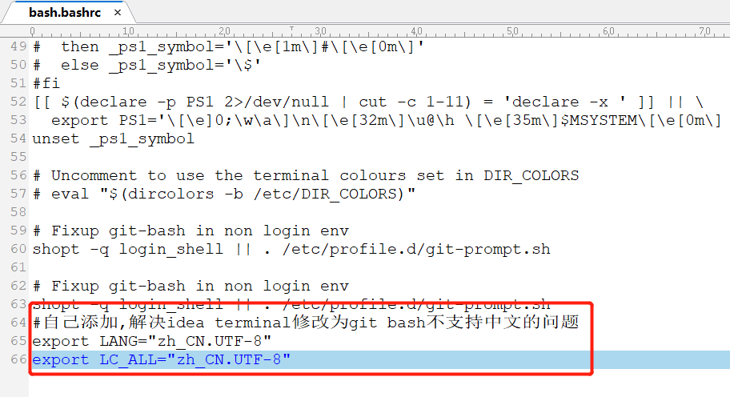

---

title: IDEA Terminal修改为git bash并解决中文转unicode问题

categories:

- 常用工具使用
- IDEA

tags:

- IDEA

abbrlink: d5a08ebf

date: 2018-05-16 15:02:30

---

### 1. IDEA Terminal修改为git bash ###

由于IDEA自带的Terminal工具是Windows命令窗口cmd,在开发过程中需要用到一些常用的命令操作时要不断的在IDEA和git bash之间来回切换，大大降低了我们的开发效率，所以我们需要找到一种两全其美的方法-将IDEA Terminal命令窗口修改为git bash命令窗口。

<!-- more -->

1. 打开settings设置界面(File -> settings):

	

2. 在settings设置界面选择Tools中的Terminal(Tools -> Terminal):

	

3. 修改Shell path为你的git bash安装路径：

	

4. 重新打开你的Terminal查看效果:

	

### 2. 解决中文转unicode问题 ###

1. 我们发现IDEA Terminal修改为git bash后控制台的中文字符会自动转换为unicode编码:

	

2. 修改git安装路径(这是我的git安装路径C:\Program Files (inst)\Git\etc)下bash.bashrc文件，在该文件最后添加：

		export LANG="zh_CN.UTF-8"
		export LC_ALL="zh_CN.UTF-8"

	

3. 重启IDEA，打开Terminal查看中文内容，成功显示！

	
