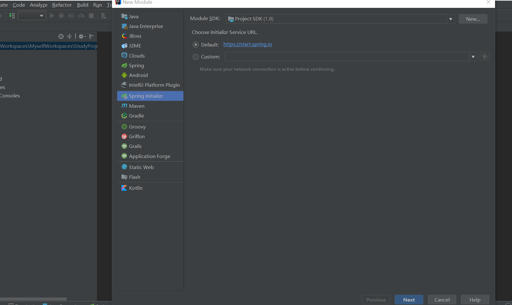
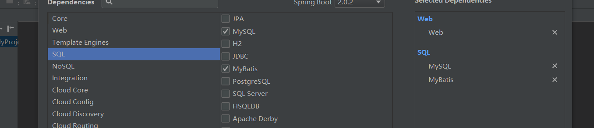

---

title: SpringBoot笔记系列：（二）SpringBoot快速入门

categories:

- Java
- SpringBoot学习笔记

tags:

- SpringBoot

abbrlink: '669756e8'

date: 2018-05-28 18:03:20

---

#### 1. 创建一个Maven工程 ####

创建一个名为”springboot-helloworld” 类型为Jar工程项目

<!-- more -->







#### 2. pom文件引入依赖 ####

```xml

<parent>
	<groupId>org.springframework.boot</groupId>
	<artifactId>spring-boot-starter-parent</artifactId>
	<version>2.0.1.RELEASE</version>
	<relativePath/> <!-- lookup parent from repository -->
</parent>
<dependencies>
    <dependency>
	<groupId>org.springframework.boot</groupId>
	<artifactId>spring-boot-starter-web</artifactId>
    </dependency>

    <dependency>
	<groupId>mysql</groupId>
	<artifactId>mysql-connector-java</artifactId>
	<scope>runtime</scope>
    </dependency>
    <dependency>
	<groupId>org.springframework.boot</groupId>
	<artifactId>spring-boot-starter-test</artifactId>
	<scope>test</scope>
    </dependency>
</dependencies>
<build>
    <plugins>
	<plugin>
	    <groupId>org.springframework.boot</groupId>
	    <artifactId>spring-boot-maven-plugin</artifactId>
	</plugin>
    </plugins>
</build>

```

- spring-boot-starter-parent作用：在pom.xml中引入spring-boot-start-parent,spring官方的解释叫什么stater poms,它可以提供dependency management,也就是说依赖管理，引入以后在申明其它dependency的时候就不需要version了，后面可以看到。  

- spring-boot-starter-web作用：springweb 核心组件。

- spring-boot-maven-plugin作用：如果我们要直接Main启动spring，那么以下plugin必须要添加，否则是无法启动的。如果使用maven 的spring-boot:run的话是不需要此配置的。

#### 3. 编写HelloWorld服务 ####

创建package包名top.pcstar.springboothelloworld.controller（根据实际情况修改）  
创建HelloController类，内容如下：

```java

@RestController
@EnableAutoConfiguration
public class HelloController {
    @RequestMapping("/hello")
    public String index() {
	return "Hello World";
    }
    public static void main(String[] args) {
	SpringApplication.run(HelloController.class, args);
    }
}

```

#### 4. @RestController ####

在类上加上注解@RestController表示修饰该Controller所有的方法返回JSON格式,直接可以编写
Restful接口;  
@RestController = @Controller + @ResponseBody

#### 5. @EnableAutoConfiguration ####

@EnableAutoConfiguration注解:作用在于让 Spring Boot根据应用所声明的依赖来对 Spring 框架进行自动配置;  
@EnableAutoConfiguration注解告诉Spring Boot根据添加的jar依赖猜测你想如何配置Spring。由于spring-boot-starter-web添加了Tomcat和Spring MVC，所以auto-configuration将假定你正在开发一个web应用并相应地对Spring进行设置。  

#### 6. SpringApplication.run(HelloController.class, args); ####

标识为启动类，Spring Boot用它来启动项目

#### 7. SpringBoot启动方式1 ####

Spring Boot默认端口号为8080  

```java
@RestController
@EnableAutoConfiguration
public class HelloController {
    @RequestMapping("/hello")
    public String index() {
	return "Hello World!";
    }
    public static void main(String[] args) {
	SpringApplication.run(HelloController.class, args);
    }
}
```

启动主程序，打开浏览器访问 http://localhost:8080/hello ，可以看到页面输出Hello World

#### 8. SpringBoot启动方式2 ####

扫包范围：controller控制器包  
@ComponentScan(basePackages = "top.pcstar.springboothelloworld.controller")  

```java
/**
 * @Author: PanChao
 * @Description: 启动类
 * @Date: Created in 12:56 2018/5/29
 */
@EnableAutoConfiguration
@ComponentScan(basePackages = "top.pcstar.springboothelloworld.controller")
public class App {
    public static void main(String[] args) {
	SpringApplication.run(App.class, args);
    }
}
```

#### 9. SpringBoot启动方式3 ####

@SpringBootApplication作用：启动项目，整合常用注解，扫包作用，只能在当前同级包下  
@SpringBootApplication=@SpringBootConfiguration + @EnableAutoConfiguration + @ComponentScan

```java
package top.pcstar.springboothelloworld;

import org.springframework.boot.SpringApplication;
import org.springframework.boot.autoconfigure.SpringBootApplication;

/**
 * @Author: PanChao
 * @Description: 启动类
 * @Date: Created in 12:56 2018/5/29
 */
//@EnableAutoConfiguration
//@ComponentScan(basePackages = "top.pcstar.springboothelloworld.controller")
//@EntityScan("top.pcstar.springboothelloworld.entity")
//@EnableJpaRepositories("top.pcstar.springboothelloworld.dao")
@SpringBootApplication
public class App {
    public static void main(String[] args) {
        SpringApplication.run(App.class, args);
    }
}
```

[查看源码](https://github.com/pcstartop/springboot/tree/master/springboot-helloworld)  

[SpringBoot笔记系列目录](e0c584e.html)  
