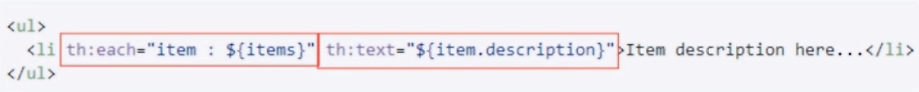

---

title: SpringBoot笔记系列：（七）Thymeleaf模板引擎

categories:

- Java
- SpringBoot学习笔记

tags:

- SpringBoot
- Thymeleaf

abbrlink: 2132ac76

date: 2018-06-01 17:32:11

---

Thymeleaf是一个跟Velocity、FreeMarker类似的模板引擎，他可以完全替代JSP。相比较与其他的模板引擎，他有如下三个吸引人的特点：

1. Thymeleaf在有网络和无网络的环境中皆可以运行，即它可以让美工在浏览器查看页面效果，也可以让程序员在服务器查看带数据的动态页面效果。这是由于它支持html原型，然后在html标签里增加了额外的属性来达到模板+数据的展示方式。浏览器解释时会忽略未定义的标签属性，所以Thymeleaf模板可以静态的运行；当有数据返回到页面时，Thymeleaf标签会动态的替换掉静态内容，是页面动态显示。  
2. Thymeleaf开箱即用的特性。它提供标准和spring标准两种方言，可以直接套用模板实现JSTL、OGNL表达式效果，避免每天套模板、改jstl、改标签的困扰。同时开发人员也可以扩展和创建自定义的方言。  
3. Thymeleaf提供spring标准方言和一个与SpringMVC完美集成的可选模块，可以快速的实现表单绑定、属性编辑器、国际化等功能。

<!-- more -->

## 1.理解Thymeleaf ##

- Java模板引擎。能够处理HTML、XML、JavaScript、CSS甚至纯文本。类似JSP、Freemarker  
- 自然模板。原型即页面  
- 语法优雅易懂。OGNL、SpringEL  
- 遵从Web标准。支持HTML5  

## 2.Thymeleaf标准方言 ##

### 2.1.识别标准方言： ###

```html
<span th:text="...">
<span data-th-text="...">
```


### 2.2.标准方言： ###

- 标准表达式
- 设置属性值
- 迭代器
- 条件语句
- 模板布局
- 属性优先级
- 注释
- 内联
- 基本对象
- 工具对象
- ...

#### 2.2.1.标准表达式 ####

##### 2.2.1.1.变量表达式 #####

语法：${...}


##### 2.2.1.2.消息表达式： #####

语法：#{...}  
也称为文本外部化、国际化或i18n  


##### 2.2.1.3.选择表达式： #####

语法：*{...}  
与变量表达式区别：它们是在当前选择的对象而不是整个上下文变量映射上执行  


##### 2.2.1.4.链接表达式： #####

语法：@{...}  
连接表达式可以是相对的，在种种情况下，应用程序上下文将不会作为URL的前缀：  


也可以是服务器相对（同样，没有应用程序上下文前缀）： 


 
也可以和协议相对（就像绝对URL，但浏览器将使用在显示的页面中使用的相同的HTTP或HTTPS协议）：  


当然，链接表达式可以是绝对的：  


##### 2.2.1.5.分段表达式： #####

语法：th:insert或th:replace  


##### 2.2.1.6.字面量（文字） #####

文本  


数字  


布尔  


null  


算术操作：+、-、*、/、%  


比较：>、<、>=、<=（gt、lt、ge、le）  


等价：==、!=（eq、ne）  


条件运算符：  


无操作(就是什么都不做)：-  


#### 2.2.2.设置属性值 ####

设置任意属性值：th:attr  


设置值到指定的属性  


固定值布尔属性  


#### 2.2.3.迭代器 ####

基本的迭代器 th:each  


状态变量index、count、size、current、even/odd、first、last  


#### 2.2.4.条件语句 ####

th:if  
th:unless  


th:switch(th:case)  


#### 2.2.5.模板布局 ####

定义和引用模板

1. 使用th:fragment  


2. 不使用th:fragment  


th:insert、th:replace、th:include三者的区别：  
th:insert 它将简单的插入指定的片段作为正文的主标签。  
th:replace 用指定的实际碎片来替换其主标签。   
th:include类似于th:insert，但不是插入片段，他只插入片段的内容。（3.x版本后，不再推荐使用）  




#### 2.2.6.属性优先级 ####

当在同一个标签中写入多个th:*属性时，会发生什么?  




#### 2.2.7.注释 ####

标准的HTML/XHTML注释  


Thymeleaf解析器级注释块：删除<!--/*和*/-->之间的所有内容：静态时会显示内容，动态执行时不会显示  


原型注释块（<!--/*/和/*/-->）：当模板静态打开时(比如原型设计)，原型注释块所注释的代码将被注释，而在模板执行时，这些注释的代码就能被显示出来。  


#### 2.2.7.内联 ####

内联表达式：[[...]]或[(...)]分别对应于th:text和th:utext  


禁用内联：有时候需要禁用这种机制，比如，想输入[[...]]或[(...)]文本内容  


JavaScript内联  


CSS内联  


#### 2.2.8.表达式基本对象 ####

基本对象：  

    #ctx:上下文对象。是org.thymeleaf.context.IContext或者org.thymeleaf.context.IWebContext的实现  
    #locale:直接访问与java.util.Locale关联的当前的请求  


request/session等属性：  
param：用于检索请求参数  
session：用于检索session属性  
application：用于检索application/servlet上下文属性  


Web上下文对象： 
 
    #request：直接访问与当前请求关联的javax.servlet.http.HttpServletRequest对象  
    #session：直接访问与当前请求关联的javax.servlet.http.HttpSession对象  
    #servletContext：直接访问与当前请求关联的javax.servlet.ServletContext对象  


## 3.Thymeleaf与Spring Boot集成 ##

3.1.在pom文件中引入依赖jar包spring-boot-starter-thymeleaf

```xml
<dependency>
    <groupId>org.springframework.boot</groupId>
    <artifactId>spring-boot-starter-thymeleaf</artifactId>
</dependency>
```

3.2.修改application.yml

```yml
spring:
  thymeleaf: # THYMELEAF
    encoding: UTF-8 #字符编码
    cache: false # 热部署静态文件
    mode: HTML5 # 使用HTML5标准
```

3.3.Thymeleaf与Spring Boot集成完毕

[查看源码](https://github.com/pcstartop/springboot/tree/master/springboot-thymeleaf)

[SpringBoot笔记系列目录](./2018-05-28-SpringBoot笔记系列目录.md)
