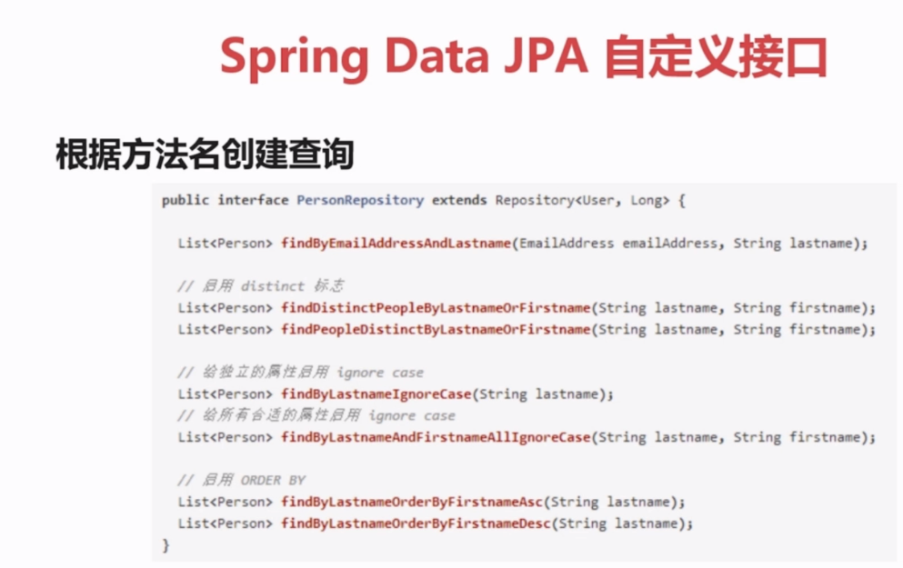
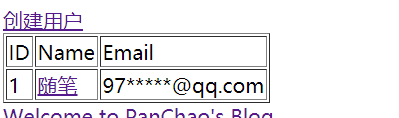
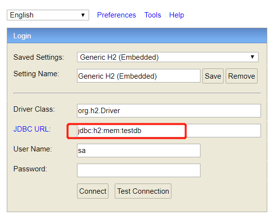
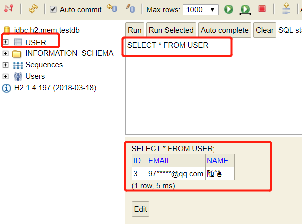

---

title: SpringBoot笔记系列：（十）数据持久化Spring Data JPA

categories:

- Java
- SpringBoot学习笔记

tags:

- SpringBoot
- Spring
- JPA

abbrlink: 35ccdbf6

date: 2018-06-02 18:42:49

---

Spring Data JPA是Spring数据家族的一部分，它使实现基于JPA的存储库变得很容易。此模块处理对基于JPA的数据访问层的增强支持。它使构建使用数据访问技术的spring驱动的应用程序更加容易。

<!-- more -->

### 1.JPA 简介 ###

#### 1.1.什么是JPA ####

- JPA ( Java Persistence API )是用于管理Java EE和Java SE环境
中的持久化,以及对象/关系映射的Java API
- 最新规范为"JSR 338: Java Persistence 2.1"https://jcp.org/en/jsr/detail?id=338
- 实现: EclipseLink, Hibernate, Apache OpenJPA

#### 1.2.JPA核心概念 ####

##### 实体： #####

1. 实体表示关系数据库中的表
2. 每个实体中的实例对应于该表中的行
3. 类必须用javax.persistence.Entity注解
4. 类必须有一个public或protected的无参数的构造函数
5. 实体实例被当作值以分离对象方式进行传递(例如通过会话bean的远程业务接口) ,则该类必须实现Serializable接口
6. 唯一的对象标识符:简单主键(Javax.persistence.ld )、复合主键(javax.persistence.Embeddedld和javax.persistence.ldClass )

##### 关系： #####

- 一对一：@OneToOne
- 一对多：@OneToMany
- 多对一：@ManyToOne
- 多对多：@ManyToMany

##### EntityManager接口： #####

- 定义用于与持久性上下文进行交互的方法
- 创建和删除持久实体实例，通过实体的主键查找实体
- 允许在实体上运行查询

##### 获取EntityManager实例 #####

```java
public class Test {
    @PersistenceUnit
    EntityManagerFactory emf;
    EntityManager em;
    @Resource
    UserTransaction utx;

    public void ceshi() {
        em = emf.createEntityManager();
        try {
            utx.begin();
            em.persist(SomeEntity);
            em.merge(AnotherEntity);
            em.remove(ThirdEntity);
            utx.commit();
        } catch (Exception e) {
            try {
                utx.rollback();
            } catch (SystemException e1) {
                e1.printStackTrace();
            }
        }
    }

}
```

#####  查找实体 #####
```java
public class Test {
    @PersistenceContext
    EntityManager em;

    public void enterOrder(int custiD, CustomerOrder newOrder) {
        Customer cust = em.find(Customer.class, custID);
        cust.getorders().add(neworder);
        neworder.setCustomer(cust);
    }

}
```

### 2.Spring Data JPA 用法介绍 ###

#### Spring Data JPA是什么?   ####

- 是更大的 Spri ng Data家族的一部分
- 对基于 JPA的数据访问层的增强支持
- 更容易构建基于使用 Spring数据访问技术栈的应用程序

#### Spring DataJPA常用接口   ####

CrudRepository接口：  
```java
//
// Source code recreated from a .class file by IntelliJ IDEA
// (powered by Fernflower decompiler)
//

package org.springframework.data.repository;

import java.util.Optional;

@NoRepositoryBean
public interface CrudRepository<T, ID> extends Repository<T, ID> {
    <S extends T> S save(S var1);

    <S extends T> Iterable<S> saveAll(Iterable<S> var1);

    Optional<T> findById(ID var1);

    boolean existsById(ID var1);

    Iterable<T> findAll();

    Iterable<T> findAllById(Iterable<ID> var1);

    long count();

    void deleteById(ID var1);

    void delete(T var1);

    void deleteAll(Iterable<? extends T> var1);

    void deleteAll();
}
```

PagingAndSortingRepository接口：  

```java
//
// Source code recreated from a .class file by IntelliJ IDEA
// (powered by Fernflower decompiler)
//

package org.springframework.data.repository;

import org.springframework.data.domain.Page;
import org.springframework.data.domain.Pageable;
import org.springframework.data.domain.Sort;

@NoRepositoryBean
public interface PagingAndSortingRepository<T, ID> extends CrudRepository<T, ID> {
    Iterable<T> findAll(Sort var1);

    Page<T> findAll(Pageable var1);
}
```

#### Spring DataJPA自定义接口 ####



### 3.Spring Data JPA、Hibernate 与 Spring Boot 集成 ###

在pom文件中添加依赖jar包

```xml
<!-- Spring Data JPA jar包 -->
<dependency>
    <groupId>org.springframework.boot</groupId>
    <artifactId>spring-boot-starter-data-jpa</artifactId>
</dependency>
```

### 5.后台编码 ###

编写实体类User:

```java
package top.pcstar.springbootthymeleaf.domain;

import javax.persistence.Entity;
import javax.persistence.GeneratedValue;
import javax.persistence.GenerationType;
import javax.persistence.Id;

/**
 * @Author: PanChao
 * @Description: User实体类
 * @Date: Created in 16:10 2018/6/1
 */
@Entity //实体
public class User {
    @Id //主键
    @GeneratedValue(strategy = GenerationType.IDENTITY) //自增策略
    private Long id; // 用户的唯一标识
    private String name;
    private String email;

    protected User() { //无参构造器设置为protected，防止直接使用
    }

    public User(Long id, String name, String email) {
        this.id = id;
        this.name = name;
        this.email = email;
    }

    public Long getId() {
        return id;
    }

    public void setId(Long id) {
        this.id = id;
    }

    public String getName() {
        return name;
    }

    public void setName(String name) {
        this.name = name;
    }

    public String getEmail() {
        return email;
    }

    public void setEmail(String email) {
        this.email = email;
    }

    @Override
    public String toString() {
        return "User{" +
                "id=" + id +
                ", name='" + name + '\'' +
                ", email='" + email + '\'' +
                '}';
    }
}
```

编写资源库UserRepository:

```java
package top.pcstar.springbootthymeleaf.repository;

import org.springframework.data.repository.CrudRepository;
import top.pcstar.springbootthymeleaf.domain.User;

/**
 * @Author: PanChao
 * @Description: 用户仓库
 * @Date: Created in 16:17 2018/6/1
 */
public interface UserRepository extends CrudRepository<User, Long> {
}
```

编写控制器UserContorller:

```java
package top.pcstar.springbootthymeleaf.controller;

import org.springframework.beans.factory.annotation.Autowired;
import org.springframework.ui.Model;
import org.springframework.web.bind.annotation.*;
import org.springframework.web.servlet.ModelAndView;
import top.pcstar.springbootthymeleaf.domain.User;
import top.pcstar.springbootthymeleaf.repository.UserRepository;

/**
 * @Author: PanChao
 * @Description: 用户控制器
 * @Date: Created in 16:24 2018/6/1
 */
@RestController
@RequestMapping("/users")
public class UserController {
    @Autowired
    private UserRepository userRepository;

    /**
     * 查询所用用户
     *
     * @param model
     * @return
     */
    @GetMapping
    public ModelAndView list(Model model) {
        model.addAttribute("userList", userRepository.findAll());
        model.addAttribute("title", "用户管理");
        return new ModelAndView("users/list", "userModel", model);
    }

    /**
     * 根据id查询用户
     *
     * @param id
     * @param model
     * @return
     */
    @GetMapping("{id}")
    public ModelAndView view(@PathVariable("id") Long id, Model model) {
        User user = userRepository.findById(id).get();
        model.addAttribute("user", user);
        model.addAttribute("title", "查看用户");
        return new ModelAndView("users/view", "userModel", model);
    }

    /**
     * 获取 form 表单页面
     *
     * @param model
     * @return
     */
    @GetMapping("/form")
    public ModelAndView createForm(Model model) {
        model.addAttribute("user", new User(null, null, null));
        model.addAttribute("title", "创建用户");
        return new ModelAndView("users/form", "userModel", model);
    }

    /**
     * 新建用户
     *
     * @param user
     * @return
     */
    @PostMapping
    public ModelAndView create(User user) {
        userRepository.save(user);
        return new ModelAndView("redirect:/users");
    }

    /**
     * 删除用户
     *
     * @param id
     * @return
     */
    @GetMapping(value = "delete/{id}")
    public ModelAndView delete(@PathVariable("id") Long id) {
        userRepository.deleteById(id);
        return new ModelAndView("redirect:/users");
    }

    /**
     * 修改用户
     *
     * @param id
     * @return
     */
    @GetMapping(value = "modify/{id}")
    public ModelAndView modifyForm(@PathVariable("id") Long id, Model model) {
        User user = userRepository.findById(id).get();
        model.addAttribute("user", user);
        model.addAttribute("title", "修改用户");
        return new ModelAndView("users/form", "userModel", model);
    }
}
```

### 6.持久化数据到H2 ###

#### 6.1.在pom文件中添加依赖jar包： ####

```xml
<!-- h2数据库jar包 -->
<dependency>
    <groupId>com.h2database</groupId>
    <artifactId>h2</artifactId>
    <scope>runtime</scope>
</dependency>
```

#### 6.2.在application.yml中开启h2数据库控制台： ####

```yml
spring:
  h2:
    console:
      enabled: true #使用h2控制台
```

#### 6.3.在前台页面添加数据到h2数据库： ####




#### 6.4.在h2控制台查看数据是否持久化到h2数据库中： ####

##### 6.4.1.访问http://localhost:8080/h2-console进入h2控制台： #####




##### 6.4.2.点击Connect进入控制台： #####




### 7.持久化数据到MySQL ###

在pom文件中添加依赖jar包：

```xml
<!-- mysql驱动 jar包 -->
<dependency>
    <groupId>mysql</groupId>
    <artifactId>mysql-connector-java</artifactId>
    <scope>runtime</scope>
</dependency>
```

在application.yml中配置数据源和JPA相关参数：

```yml
spring:
  datasource: #数据源配置
    url: jdbc:mysql://127.0.0.1:3306/test?useSSL=false&serverTimezone=UTC&characterEncoding=utf-8 #数据库URL
    username: test #用户名
    password: 888888 #密码
    driver-class-name: com.mysql.jdbc.Driver #数据库驱动类
  jpa: #配置jpa
    show-sql: true #控制台是否显示sql
    hibernate:
      ddl-auto: create-drop #应用启动时自动创建删除数据库
```

从前台新增一条数据，查看mysql中是否新增成功。  

[查看源码](https://github.com/pcstartop/springboot/tree/master/springboot-jpa)

[SpringBoot笔记系列目录](./2018-05-28-SpringBoot笔记系列目录.md)
