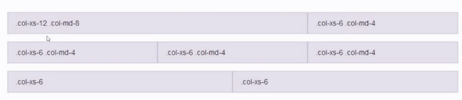

---

title: SpringBoot笔记系列：（十五）集成Bootstrap

categories:

- Java
- SpringBoot学习笔记

tags:

- SpringBoot
- Bootstrap

abbrlink: ebc7c387

date: 2018-06-03 18:53:52

---

Bootstrap 是最受欢迎的 HTML、CSS 和 JS 框架，用于开发响应式布局、移动设备优先的 WEB 项目。

<!-- more -->

### 1.Bootstrap 简介 ###

#### 1.1.Bootstrap是什么? ####

- 基于HTML、CSS、JavaScript的前端框架
- 响应式布局
- 移动设备优先

#### 1.2.HTML5 doctype ####

```html
<!DOCTYPE html>
<html lang="en">
...
</html>
```

#### 1.3.响应式meta标签 ####

```html
<meta name="viewport" content="width=device-width, initial-scale=1.0">
```

#### 1.4.Normalize.css ####

- 使用Normalize来建立跨浏览器的一致性
- Reboot

### 2.Bootstrap 核心概念 ###

#### 2.1.Bootstrap网格系统   ####

什么是移动设备优先策略呢？

- 基础的CSS是移动优先。优先设计更小的宽度
- 媒体查询。针对于平板电脑、台式电脑
- 渐进增强。随着屏幕大小的增加而添加元素

#### 2.2.响应式：viewport尺寸的增加，系统会自动分为最多12列 ####


#### 2.3.Bootstrap网格选项 ####


#### 2.4.Bootstrap网格示例   ####

移动设备及桌面设备 .col-xs-* 、 .col-md-*  

示例1：


效果1：




示例2：


效果2：


示例3：


效果3：


#### 2.5.Bootstrap常用组件、样式： ####

- Typography
- Table
- Form
- Button
- Dropdown
- ButtonGroup
- Input Group
- Navbar
- Pagination
- Tag
- Alert
- ModalDialog
- Progress Bar
- List Group
- Card
- Tooltip
- ...

### 3.Bootstrap 及常用前端框架与Spring Boot集成 ###

#### 3.1.从 http://getbootstrap.com/ 上下载 Bootstrap 的最新版本 ####


#### 3.2.将Bootstrap文件解压到SpringBoot的static目录下 ####


#### 3.3.在static中创建一个静态ceshi.html，引入Bootstrap文件 ####

```html
<!DOCTYPE html>
<html>
<head>
    <title>Bootstrap 模板</title>
    <meta name="viewport" content="width=device-width, initial-scale=1.0" charset="UTF-8">
    <!-- 引入 Bootstrap -->
    <link href="https://maxcdn.bootstrapcdn.com/bootstrap/3.3.7/css/bootstrap.min.css" rel="stylesheet">

    <!-- HTML5 Shiv 和 Respond.js 用于让 IE8 支持 HTML5元素和媒体查询 -->
    <!-- 注意： 如果通过 file://  引入 Respond.js 文件，则该文件无法起效果 -->
    <!--[if lt IE 9]>
    <script src="https://oss.maxcdn.com/libs/html5shiv/3.7.0/html5shiv.js"></script>
    <script src="https://oss.maxcdn.com/libs/respond.js/1.3.0/respond.min.js"></script>
    <![endif]-->
</head>
<body>
<h1>Hello, world!</h1>

<!-- jQuery (Bootstrap 的 JavaScript 插件需要引入 jQuery) -->
<script src="https://code.jquery.com/jquery.js"></script>
<!-- 包括所有已编译的插件 -->
<script src="js/bootstrap.min.js"></script>
</body>
</html>
```

#### 3.4.启动服务，访问 http://localhost:8080/ceshi.html ，查看Bootstrap是否集成成功。 ####


### 4.Bootstrap实战 ###

参看项目源码。

[查看源码](https://github.com/pcstartop/springboot/tree/master/springboot-bootstrap)

[SpringBoot笔记系列目录](./2018-05-28-SpringBoot笔记系列目录.md)
