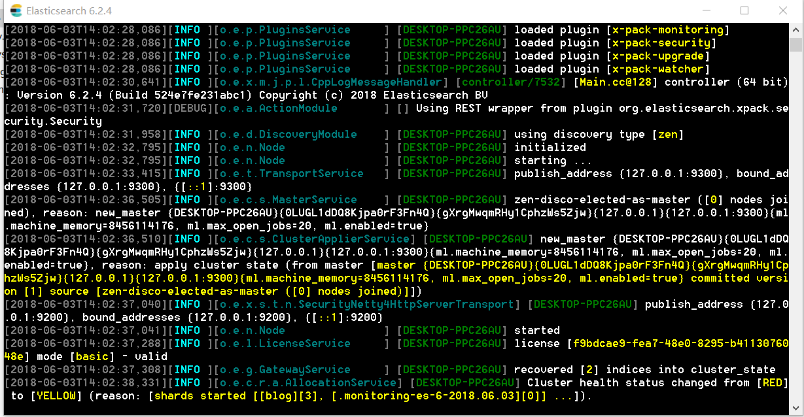

---

title: SpringBoot笔记系列：（十四）全文搜索ElasticSearch

categories:

- Java
- SpringBoot学习笔记

tags:

- SpringBoot
- ElasticSearch

abbrlink: f105e148

date: 2018-06-03 13:42:12

---

ElasticSearch是一个基于Lucene的搜索服务器。它提供了一个分布式多用户能力的全文搜索引擎，基于RESTful web接口。Elasticsearch是用Java开发的，并作为Apache许可条款下的开放源码发布，是当前流行的企业级搜索引擎。设计用于云计算中，能够达到实时搜索，稳定，可靠，快速，安装使用方便。

<!-- more -->

### 1.全文搜索概述 ###

数据结构：

- 结构化：指具有国定格式或有限长度的数据，如数据库，元数据等。
- 非结构化：指不定长或无固定格式的数据，如邮件，word文档等。

非结构化数据检索：

- 顺序扫描法（Serial Scanning）
- 全文搜索（Full-text Search）

全文搜索概念：全文搜索是一种将文件中所有文本与搜索项匹配的文字资料检索方法。

全文搜索实现原理：建文本库——>建立索引——>执行搜索——>过滤结果

全文搜索实现技术(基于Java的开源实现)：

- Lucene
- ElasticSearch
- Solr

### 2.ElasticSearch 简介 ###

ElasticSearch是什么?

- 高度可扩展的开源全文搜索和分析引擎
- 快速地、近实时地对大数据进行存储、搜索和分析
- 用来支撑有复杂的数据搜索需求的企业级应用

ElasticSearch特点：

- 分布式
- 高可用
- 多类型
- 多API
- 面向文档
- 异步写入
- 近实时
- 基于Lucene
- Apache协议

### 3.ElasticSearch 核心概念 ###

- 近实时
- 集群
- 节点
- 索引
- 类型
- 文档(使用json格式)
- 分片
- 副本

### 4.Elasticsearch 与 Spring Boot 集成 ###

在pom文件中添加依赖jar包

```xml
<!-- 添加Spring Data ElasticSearch依赖jar包 -->
<dependency>
    <groupId>org.springframework.boot</groupId>
    <artifactId>spring-boot-starter-data-elasticsearch</artifactId>
</dependency>
<!-- 添加JNA依赖jar包 -->
<dependency>
    <groupId>net.java.dev.jna</groupId>
    <artifactId>jna</artifactId>
</dependency>
```

修改application.yml

```yml
spring:
  data:
    elasticsearch:
      cluster-nodes: localhost:9300 #elasticsearch服务地址
      properties:
        transport:
          tcp:
            connect_timeout: 120s #设置连接超时时间
```

下载Elasticsearch服务端应用程序并启动。

### 5.Elasticsearch练习 ###

#### 5.1.创建实体类EsBlog.java: ####

```java
package top.pcstar.springbootelasticsearch.domain;

import org.springframework.data.annotation.Id;
import org.springframework.data.elasticsearch.annotations.Document;

import java.io.Serializable;

/**
 * @Author: PanChao
 * @Description: Blog文档
 * @Date: Created in 10:36 2018/6/3
 */
@Document(indexName = "blog",type = "blog") //主键
public class EsBlog implements Serializable {
    public static final long seriaVersionUID = 1L;
    @Id //文档
    private String id; //id
    private String title; //标题
    private String summary; //摘要
    private String content; //正文

    public EsBlog() { //JPA规范要求，防止直接使用

    }

    public EsBlog(String title, String summary, String content) {
        this.title = title;
        this.summary = summary;
        this.content = content;
    }

    public String getId() {
        return id;
    }

    public void setId(String id) {
        this.id = id;
    }

    public String getTitle() {
        return title;
    }

    public void setTitle(String title) {
        this.title = title;
    }

    public String getSummary() {
        return summary;
    }

    public void setSummary(String summary) {
        this.summary = summary;
    }

    public String getContent() {
        return content;
    }

    public void setContent(String content) {
        this.content = content;
    }

    @Override
    public String toString() {
        return "EsBlog{" +
                "id='" + id + '\'' +
                ", title='" + title + '\'' +
                ", summary='" + summary + '\'' +
                ", content='" + content + '\'' +
                '}';
    }
}
```

#### 5.2.创建Repository资源库EsBlogRepository.java: ####

```java
package top.pcstar.springbootelasticsearch.Repository;

import org.springframework.data.domain.Page;
import org.springframework.data.domain.Pageable;
import org.springframework.data.elasticsearch.repository.ElasticsearchRepository;
import top.pcstar.springbootelasticsearch.domain.EsBlog;

/**
 * @Author: PanChao
 * @Description: EsBlogRepository接口
 * @Date: Created in 10:41 2018/6/3
 */
public interface EsBlogRepository extends ElasticsearchRepository<EsBlog, String> {
    /**
     * 分页查询博客
     * @param title
     * @param summary
     * @param content
     * @param pageable
     * @return
     */
    Page<EsBlog> findDistinctByTitleContainingOrSummaryContainingOrContentContaining(String title, String summary, String content, Pageable pageable);
}
```

#### 5.3.编写资源库测试用例EsBlogRepositoryTest.java: ####

```java
package top.pcstar.springbootelasticsearch.Repository;

import org.junit.Assert;
import org.junit.Before;
import org.junit.Test;
import org.junit.runner.RunWith;
import org.springframework.beans.factory.annotation.Autowired;
import org.springframework.boot.test.context.SpringBootTest;
import org.springframework.data.domain.Page;
import org.springframework.data.domain.PageRequest;
import org.springframework.data.domain.Pageable;
import org.springframework.test.context.junit4.SpringRunner;
import top.pcstar.springbootelasticsearch.domain.EsBlog;

/**
 * @Author: PanChao
 * @Description: EsBlogRepository接口测试用例
 * @Date: Created in 10:55 2018/6/3
 */
@RunWith(SpringRunner.class)
@SpringBootTest
public class EsBlogRepositoryTest {
    @Autowired
    private EsBlogRepository esBlogRepository;

    @Before
    public void initRepositoryData() {
        esBlogRepository.deleteAll();//清除所有数据
        esBlogRepository.save(new EsBlog("登鹳雀楼", "王之涣的登鹳雀楼", "白日依山尽，黄河入海流。欲穷千里目，更上一层楼。"));
        esBlogRepository.save(new EsBlog("静夜思", "李白的静夜思", "床前明月光，疑是地上霜。举头望明月，低头思故乡。"));
        esBlogRepository.save(new EsBlog("相思", "王维的相思", "红豆生南国，春来发几枝。愿君多采撷，此物最相思。"));
    }

    @Test
    public void testFindDistinctByTitleContainingOrSummaryContainingOrContentContaining() {
        Pageable pageable = PageRequest.of(0, 20);
        String title = "思";
        String summary = "相思";
        String content = "相思";
        Page<EsBlog> page = esBlogRepository.findDistinctByTitleContainingOrSummaryContainingOrContentContaining(title, summary, content, pageable);
        Assert.assertEquals(2L, page.getTotalElements());
        System.out.println("----------start 1----------");
        for (EsBlog blog : page.getContent()) {
            System.out.println(blog.toString());
        }
        System.out.println("----------end 1----------");
        title = "相";
        page = esBlogRepository.findDistinctByTitleContainingOrSummaryContainingOrContentContaining(title, summary, content, pageable);
        Assert.assertEquals(1L, page.getTotalElements());
        System.out.println("----------start 2----------");
        for (EsBlog blog : page.getContent()) {
            System.out.println(blog.toString());
        }
        System.out.println("----------end 2----------");

    }
}
```

#### 5.4.创建控制器BlogContorller.java: ####

```java
package top.pcstar.springbootelasticsearch.controller;

import org.springframework.beans.factory.annotation.Autowired;
import org.springframework.data.domain.Page;
import org.springframework.data.domain.PageRequest;
import org.springframework.data.domain.Pageable;
import org.springframework.web.bind.annotation.GetMapping;
import org.springframework.web.bind.annotation.RequestMapping;
import org.springframework.web.bind.annotation.RequestParam;
import org.springframework.web.bind.annotation.RestController;
import top.pcstar.springbootelasticsearch.Repository.EsBlogRepository;
import top.pcstar.springbootelasticsearch.domain.EsBlog;

import java.util.List;

	/**
	 * @Author: PanChao
	 * @Description: Blog控制器
	 * @Date: Created in 12:37 2018/6/3
	 */
	@RestController
	@RequestMapping("/blogs")
	public class BlogContorller {
	
	    @Autowired
	    private EsBlogRepository esBlogRepository;
	    @GetMapping
	    public List<EsBlog> list(@RequestParam(value = "title",required = false) String title,
	                             @RequestParam(value = "summary",required = false) String summary,
	                             @RequestParam(value = "content",required = false) String content,
	                             @RequestParam(value = "pageIndex",defaultValue = "0") int pageIndex,
	                             @RequestParam(value = "pageSize",defaultValue = "10") int pageSize) {
	        //数据是在测试用例中初始化的，需要线运行测试用例
	        Pageable pageable = PageRequest.of(pageIndex, pageSize);
	        Page<EsBlog> page = esBlogRepository.findDistinctByTitleContainingOrSummaryContainingOrContentContaining(title, summary, content, pageable);
	        return page.getContent();
	    }
	}
```

#### 5.5.启动Elasticsearch服务 ####



#### 5.6.启动springboot应用并执行测试用例EsBlogRepositoryTest.java初始化数据 ####

#### 5.7.在浏览器执行 ####

http://localhost:8080/blogs?title=思&summary=相思&content=相思

[查看源码](https://github.com/pcstartop/springboot/tree/master/springboot-elasticsearch)

[SpringBoot笔记系列目录](./2018-05-28-SpringBoot笔记系列目录.md)
