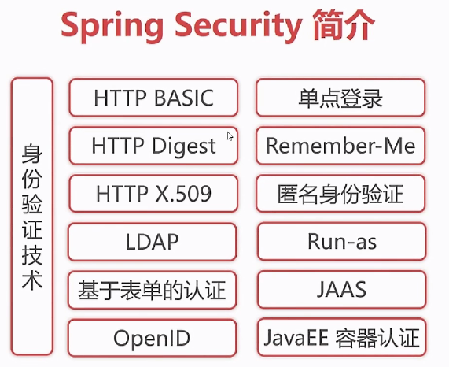

---

title: SpringBoot笔记系列：（十六）权限管理Spring Security

categories:

- Java
- SpringBoot学习笔记

tags:

- SpringBoot

abbrlink: 8835e9a

date: 2018-06-09 10:42:05

---

Spring Security是一个能够为基于Spring的企业应用系统提供声明式的安全访问控制解决方案的安全框架，在企业级应用中被广泛使用。本章节不会对该框架做深入探讨，仅从基于角色的权限管理角度，来实现对系统的权限管理。

<!-- more -->

### 1.Spring Security 简介 ###

核心领域概念：

认证（authentication）

- "认证"是建立主题（principal）的过程。"主体"通常是指可以在应用程序中执行操作的用户、设备或其他系统。



模块：

- Core - spring-security-core.jar
- Remoting - spring-security-remoting.jar
- Web - spring-security-web.jar
- Config - spring-security-config.jar
- LDAP - spring-security-ldap.jar
- ACL - spring-security-acl.jar
- CAS - spring-security-cas.jar
- OpenID - spring-security-openid.jar
- Test - spring-security-test.jar

### 2.Spring Security 与 Spring Boot 集成 ###

#### 2.1.修改pom.xml,添加依赖jar包： ####

```xml
<!-- 添加Spring Security依赖 -->
<dependency>
    <groupId>org.springframework.boot</groupId>
    <artifactId>spring-boot-starter-security</artifactId>
</dependency>
<!-- 添加Thymeleaf Spring Security依赖 -->
<dependency>
    <groupId>org.thymeleaf.extras</groupId>
    <artifactId>thymeleaf-extras-springsecurity4</artifactId>
</dependency>
```

#### 2.2.Spring Security 测试-后台编码 ####

安全配置类SecurityConfig

```java
package top.pcstar.springbootthymeleaf.config;


import org.springframework.beans.factory.annotation.Autowired;
import org.springframework.context.annotation.Bean;
import org.springframework.security.config.annotation.authentication.builders.AuthenticationManagerBuilder;
import org.springframework.security.config.annotation.web.builders.HttpSecurity;
import org.springframework.security.config.annotation.web.configuration.EnableWebSecurity;
import org.springframework.security.config.annotation.web.configuration.WebSecurityConfigurerAdapter;
import org.springframework.security.crypto.password.NoOpPasswordEncoder;

/**
 * @Author: PanChao
 * @Description: 安全配置类
 * @Date: Created in 11:57 2018/6/9
 */
@EnableWebSecurity
public class SecurityConfig extends WebSecurityConfigurerAdapter {
    /**
     * 自定义配置
     *
     * @param http
     * @throws Exception
     */
    @Override
    protected void configure(HttpSecurity http) throws Exception {
        http.authorizeRequests()
                .antMatchers("/css/**", "/js/**", "/fonts/**", "/index").permitAll()//都可以访问
                .antMatchers("/users/**").hasRole("ADMIN")//需要相应的角色才能访问
                .and()
                .formLogin()//基于form表单登陆验证
                .loginPage("/login").failureUrl("/login-error");//自定义登陆界面
    }

    /**
     * 认证信息管理
     *
     * @param auth
     * @throws Exception
     */
    @Autowired
    public void configureGlobal(AuthenticationManagerBuilder auth) throws Exception {
        auth.
                inMemoryAuthentication()//认证信息存储在内存中
                .withUser("panchao").password("123456").roles("ADMIN");
    }

    /**
     * 对密码不进行加密操作
     * @return
     */
    @Bean
    public static NoOpPasswordEncoder passwordEncoder() {
        return (NoOpPasswordEncoder) NoOpPasswordEncoder.getInstance();
    }
}
```

控制器MainController

```java
package top.pcstar.springbootthymeleaf.controller;

import org.springframework.stereotype.Controller;
import org.springframework.ui.Model;
import org.springframework.web.bind.annotation.GetMapping;

/**
 * @Author: PanChao
 * @Description: 主页控制器
 * @Date: Created in 13:25 2018/6/9
 */
@Controller
public class MainController {
    @GetMapping("/")
    public String root() {
        return "redirect:/index";
    }

    @GetMapping("/index")
    public String index() {
        return "index";
    }

    @GetMapping("/login")
    public String login() {
        return "login";
    }
    @GetMapping("login-error")
    public String loginError(Model model) {
        model.addAttribute("loginError", true);
        model.addAttribute("errorMsg", "登陆失败，用户名或密码错误!");
        return "login";
    }
}
```

#### 2.3.Spring Security 测试-前台编码 ####

index.html

```html
<!DOCTYPE html>
<html xmlns:th="http://www.thymeleaf.org"
      xmlns:layout="http://www.ultraq.net.nz/thymeleaf/layout"
      xmlns:sec="http://www.thymeleaf.org/thymeleaf-extras-springsecurity4">
<head th:replace="~{fragments/header :: header}">
</head>
<body>
<!-- Page Content -->
<div class="container blog-content-container"><!-- /.container -->
    <div sec:authorize="isAuthenticated()">
        <p>已有用户登陆</p>
        <p>登陆的用户为：<span sec:authentication="name"></span></p>
        <p>用户角色为：<span sec:authentication="principal.authorities"></span></p>
    </div>
    <div sec:authorize="isAnonymous()">
        <p>未有用户登陆</p>
    </div>
</div><!-- /.container -->
<div th:replace="~{fragments/footer :: footer}">...</div>
</body>
</html>
```

header.html

```html
<!-- 登陆判断 -->
<div sec:authorize="isAuthenticated()" class="row">
    <ul class="navbar-nav mr-auto">
        <li class="nav-item">
            <span class="nav-link" sec:authentication="name"></span>
        </li>
    </ul>
    <form action="/logout" th:action="@{/logout}" method="post">
        <input class="btn btn-outline-success" type="submit" value="退出"/>
    </form>
</div>
<div sec:authorize="isAnonymous()">
    <a href="/login" th:href="@{~/login}" class="btn btn-outline-success my-2 my-sm-0" type="submit">登录</a>
</div>
```

login.html

```html
<!DOCTYPE html>
<html xmlns:th="http://www.thymeleaf.org"
      xmlns:layout="http://www.ultraq.net.nz/thymeleaf/layout"
      xmlns:sec="http://www.thymeleaf.org/thymeleaf-extras-springsecurity4">
<head th:replace="~{fragments/header :: header}">
</head>
<body>
<!-- Page Content -->
<div class="container blog-content-container"><!-- /.container -->
    <form th:action="@{~/login}" method="post">
        <h2>请登录</h2>
        <div class="form-group col-md-5">
            <label for="username" class="col-form-label">账号</label>
            <input type="text" class="form-control" id="username" name="username" maxlength="50"/>
        </div>
        <div class="form-group col-md-5">
            <label for="password" class="col-form-label">密码</label>
            <input type="password" class="form-control" id="password" name="password" maxlength="30" placeholder="请输入密码"/>
        </div>
        <div class="form-group col-md-5">
            <button type="submit" class="btn btn-primary">登录</button>
        </div>
        <div class="col-md-5" th:if="${loginError}">
            <p class="blog-lable-error" th:text="${errorMsg}"></p>
        </div>
    </form>
</div><!-- /.container -->
<div th:replace="~{fragments/footer :: footer}">...</div>
</body>
</html>
```

#### 2.4.运行 http://localhost:8080/index 查看效果。 ####

[查看源码](https://github.com/pcstartop/springboot/tree/master/springboot-security)

[SpringBoot笔记系列目录](./2018-05-28-SpringBoot笔记系列目录.md)
