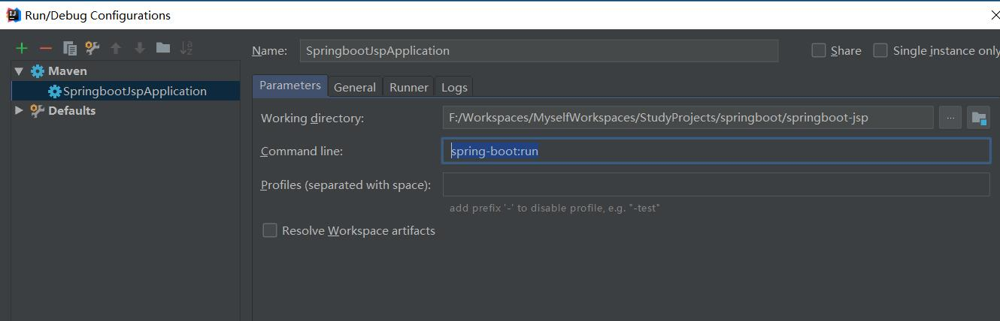

---

title: SpringBoot笔记系列：（六）SpringBoot使用JSP渲染Web视图

categories:

- Java
- SpringBoot学习笔记

tags:

- SpringBoot

abbrlink: 8114a260

date: 2018-07-15 12:16:24

---

#### SpringBoot整合JSP： ####

<!-- more -->

1.pom文件引入以下依赖:

```xml
<dependency>
    <groupId>org.springframework.boot</groupId>
    <artifactId>spring-boot-starter-web</artifactId>
</dependency>

<dependency>
    <groupId>org.springframework.boot</groupId>
    <artifactId>spring-boot-starter-tomcat</artifactId>
    <scope>provided</scope>
</dependency>
<dependency>
    <groupId>org.apache.tomcat.embed</groupId>
    <artifactId>tomcat-embed-jasper</artifactId>
</dependency>
```

2.在application.properties创建以下配置:

```properties
spring.mvc.view.prefix=/WEB-INF/jsp/
spring.mvc.view.suffix=.jsp
```

3.后台代码：

```java
package top.pcstar.springboot.springbootjsp.controller;

import org.springframework.stereotype.Controller;
import org.springframework.web.bind.annotation.RequestMapping;

/**
 * @Author: PanChao
 * @Description:
 * @Date: Created in 13:50 2018/7/15
 */
@Controller
public class IndexController {
    @RequestMapping("/index")
    public String index() {
        return "index";
    }
}

```

4.前台代码：

```html
<%@ page contentType="text/html;charset=UTF-8" language="java" %>
<html>
<head>
    <title>Title</title>
</head>
<body>
SpringBoot整合JSP成功!(注意:创建SpringBoot整合JSP，一定要为war类型，否则会找不到页面.)
</body>
</html>
```

5.启动方式：

    1. Eclipse可以使用main方法启动
    2. IDEA需要使用mvn spring-boot:run启动

IntelliJ IDEA没有将 <scope>provided</scope> 的依赖注入到类路径中,用main()方法启动的话,pom.xml里添加的这个

```xml
<dependency>
   <groupId>org.apache.tomcat.embed</groupId>
   <artifactId>tomcat-embed-jasper</artifactId>
   <scope>provided</scope>
</dependency>
```

不会被加载,用mvn spring-boot:run指令就可以了.



[SpringBoot笔记系列目录](./2018-05-28-SpringBoot笔记系列目录.md)
