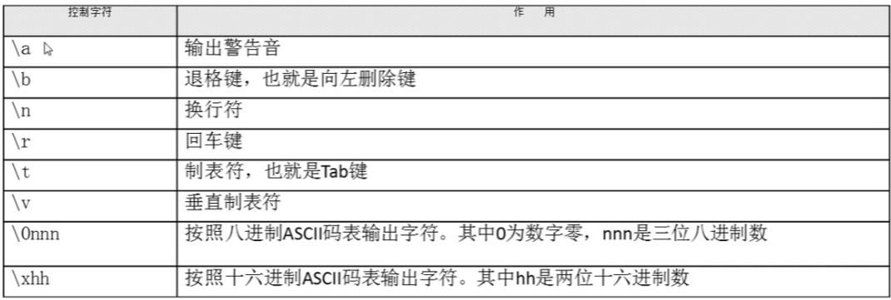

---

title: Linux中shell基础

categories:

- Linux
- Command

tags:

- Linux

abbrlink: d22e0809

date: 2018-10-03 21:49:25

---

> 学习shell基础

<!-- more -->

# 1.Linux中shell基础 #

## 1.1.Shell概述 ##

### 1.1.1.Shell是什么? ###

- Shell是一个命令行解释器，它为用户提供了一个向Linux内核发送请求以便运行程序的界面系统级程序，用户可以用Shell来启动、挂起、停止甚至是编写一些程序。
- Shell还是一个功能相当强大的编程语言，易编写，易调试，灵活性较强。Shell是解释执行的脚本语言，在Shell中可以直接调用Linux系统命令。

### 1.1.2.Shell的分类 ###

- Bourne Shell
- C Shell(语法和C语言相类似而得名)
- Shell的两种主要语法类型有Bourne和C，这两种语法批次不兼容。Bourne家族主要包括sh、ksh、Bash、psh、zsh；C家族主要包括csh、tcsh
- Linux当中主要是Bash
- Bash：Bash与sh兼容，现在使用的Linux就是使用Bash作为用户的基本Shell。

### 1.1.3.查看Linux系统使用的Shell版本： ###

- echo $SHELL

### 1.1.4.Linux中支持的Shell： ###

- 在配置文件/etc/shells中可以进行查看

## 1.2.脚本执行方式 ##

### 1.2.1.echo输出命令 ###

#### echo [选项] [输出内容] ####

**选项：**

- -e ： 支持反斜线控制的字符转换

**能够识别的控制字符：**



#### echo -e "\e[1;31m Hello World! \e[0m" ####

- 打印字符并显示颜色
- 输出颜色：
	- \#30m=黑色
	- \#31m=红色
	- \#32m=绿色
	- \#33m=黄色
	- \#34m=蓝色
	- \#35m=洋红
	- \#36m=青色
	- \#37m=白色

### 1.2.2.第一个Shell脚本 ###

#### hello.sh ####

```shell
#!/bin/bash
#The first program

echo -e "\e[1;36m 两只老虎两只老虎跑的快 \e[0m"
```

### 1.2.3.脚本执行 ###

#### 赋予执行权限，直接执行 ####

1. chmod 755 hello.sh
2. ./hello.sh

通过Bash调用执行脚本

1. bash hello.sh

## 1.3.Bash的基本功能 ##

### 1.3.1.Bash的基本功能列表： ###

1. 命令别命与快捷键
2. 历史命令
3. 输出重定向
4. 多命令顺序执行
5. Shell中特殊符号

### 1.3.2.命令别命与快捷键 ###

#### 1.3.2.1.什么是别命？ ####

- 命令别名==人的小名

#### 1.3.2.2.查看与设定别命 ####

**alias**

- \#查看系统中所有的命令别命

**alias 别命='原命令'**

- 设定命令别命，临时生效，重启系统后将被还原

#### 1.3.2.3.别名永久生效与删除别名 ####

**vi ~/.bashrc**

- \#写入环境变量配置文件

**source ~/.bashrc**

- 让配置文件生效

**unalias 别命**

- \#删除别命

#### 1.3.2.4.命令生效顺序 ####

- 第一顺位执行用绝对路径或相对路径执行的命令。
- 第二顺位执行别命。
- 第三顺位执行Bash的内部命令。
- 第四顺位执行按照$PATH环境变量定义的目录查找顺序找到的第一个命令

#### 1.3.2.5.常用快捷键 ####

快捷键 | 备注
--- | ---
ctrl+c | 强制终止当前命令
ctrl+l | 清屏
ctrl+a | 光标移动到命令行首
ctrl+e | 光标移动到命令行尾
ctrl+u | 从光标所在位置删除到行首
ctrl+z | 把命令放入后台
ctrl+r | 在历史命令中搜索

### 1.3.3.历史命令 ###

#### 1.3.3.1. history [选项] [历史命令保存文件] ####

**选项：**

- -c ： 清空历史命令
- -w ： 把缓存中的历史命令写入历史命令保存文件~/.bash_history

**调整历史命令保存大小(默认保存1000条记录)**

- 去配置文件/etc/profile或~/.bashrc中修改HISTSIZE=1000的参数大小

#### 1.3.3.2.历史命令的调用 ####

- 使用上下箭头调用以前的历史命令
- 使用"!n"重复执行第n条命令
- 使用"!!"重复执行上一条命令
- 使用"!字串"重复执行最后一条以该字串开头的命令

#### 1.3.3.3.命令与文件补全 ####

- 在Bash中，命令与文件补全是非常方便与常用的功能，我们只要在输入命令或文件时，按Tab键就会自动进行补全

### 1.3.4.输出和输入重定向 ###

#### 1.3.4.1.标准输入和输出设备 ####

设备 | 设备文件名 | 文件描述符 | 类型
--- | --- | --- | ---
键盘 | /dev/stdin | 0 | 标准输入
显示器 | /dev/stdout | 1 | 标准输出
显示器 | /dev/sdterr | 2 | 标准错误输出

#### 1.3.4.2.输出重定向 ####

类型 | 符号 | 作用
--- | --- | ---
标准输出重定向 | 命令 > 文件 | 以覆盖的方式，把命令的正确输出输出到指定的文件或设备当中
标准输出重定向 | 命令 >> 文件 | 以追加的方式，把命令的正确输出输出到指定的文件或设备当中
标准错误输出重定向 | 错误命令 2>文件 | 以覆盖的方式，把命令的错误输出输出到指定的文件或设备当中
标准错误输出重定向 | 错误命令 2>>文件 | 以追加的方式，把命令的错误输出输出到指定的文件或设备当中
正确输出和错误输出同时保存 | 命令 > 文件 2>&1 | 以覆盖的方式，把正确输出和错误输出都保存到同一个文件当中
正确输出和错误输出同时保存 | 命令 >> 文件 2>&1 | 以追加的方式，把正确输出和错误输出都保存到同一个文件当中
正确输出和错误输出同时保存 | 命令 &>文件 | 以覆盖的方式，把正确输出和错误输出都保存到同一个文件当中
正确输出和错误输出同时保存 | 命令 &>>文件 | 以追加的方式，把正确输出和错误输出都保存到同一个文件当中
正确输出和错误输出同时保存 | 命令>>文件1 2>>文件2 | 把正确的输出追加到文件以中，把错误的输出追加到文件2中

**例如：** ls &> /dev/null

- /dev/null是我们Linux中的黑洞，把正确和错误输出都重定向到黑洞当中，就相当于清空命令的执行结果
- 当我们在执行一个命令时，不需要知道它的执行结果，就可以将它丢到黑洞中
- 既不显示到屏幕，也不保存到文件当中(人间蒸发)

#### 1.3.4.3.输入重定向 ####

**wc [选项] [文件名]**

**选项：**

- -c ： 统计字节数
- -w ： 统计单词数
- -l ： 统计行数

**输入重定向：**

- 命令<文件把文件作为命令的输入
- 命令<<标识符
- ...
- 标识符把标识符之间内容作为命令的输入

### 1.3.5.管道符 ###

#### 1.3.5.1.多命令顺序执行 ####

多命令执行符 | 格式 | 作用
--- | --- | ---
; | 命令1;命令2 | 多个命令顺序执行，命令之间没有任何逻辑关系
&& | 命令1&&命令2 | 逻辑与，当命令1正确执行，则命令2才会执行；当命令1执行不正确，则命令2不会执行
&#124;&#124; | 命令1&#124;&#124;命令2 | 逻辑或，当命令1执行不正确，则命令2才会执行；当命令1正确执行，则命令2不会执行

**判断命令是否执行正确：**

- ls && echo "yes" || echo "no"

#### 1.3.5.2.管道符 ####

**命令格式：**命令1 | 命令2

- \#命令1的正确输出作为命令2的操作对象

**例如：**

- ll -a /etc/ | more
- netstat -an | grep "ESTABLISHED"

### 1.3.6.通配符 ###

通配符 | 作用
--- | ---
? | 匹配一个任意字符
* | 匹配0个或任意多个任意字符，也就是可以匹配任何内容
[] | 匹配中括号中任意一个字符。例如：[abc]代表一定匹配一个字符，或者是a，或者是b，或者是c
[-] | 匹配中括号中任意一个字符，-代表一个范围。例如：[a-z]代表匹配一个小写字母
[^] | 逻辑非，表示匹配不是中括号内的一个字符。例如：[^0-9]代表匹配一个不是数字的字符

### 1.3.7.Bash中其他特殊符号 ###

符号 | 作用
--- | ---
'' | 单引号。在单引号中所有的特殊符号，如'$'、'`'和'\'都没有特殊含义。
"" | 双引号。在双引号中特殊符号都没有特殊含义，但是'$'、'`'和'\'是例外，拥有"调用变量的值"、"引用命令"和"转义符"的特殊含义。
`` | 反引号。反引号括起来的内容是系统命令，在Bash中会先执行它。和$()作用一样，不过推荐使用$()，因为反引号非常容易看错。
$() | 和反引号作用一样，用来引用系统命令。
\# | 在Shell脚本中，#开头的行代表注释。
$ | 用于调用变量的值，如需要调用变量name的值时，需要用$name的方式得到变量的值。
\ | 转义符，跟在\之后的特殊符号将失去特殊含义，变为普通字符。如\$将输出"$"符号，而不当作是变量引用。
