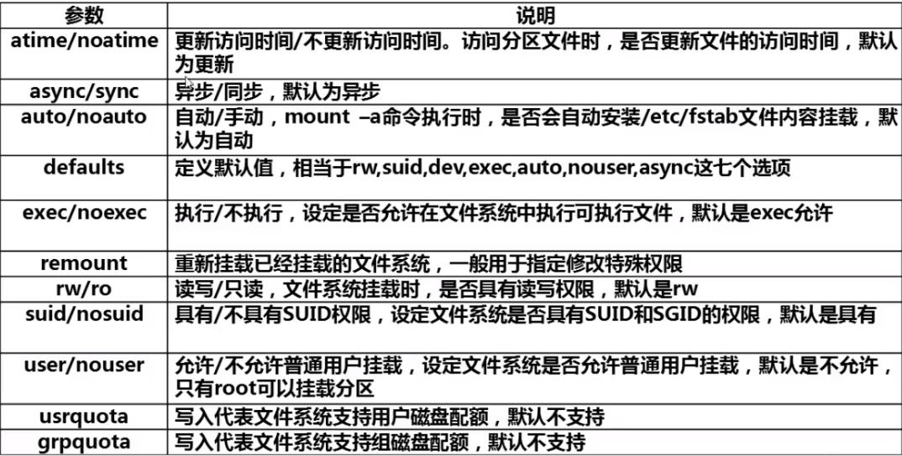

---

title: Linux中挂载命令

categories:

- Linux
- Command

tags:

- Linux

abbrlink: dfd6d287

date: 2018-10-03 20:00:46

---

> Linux中挂载命令

<!-- more -->

# Linux中挂载命令 #

## 查询与自动挂载 ##

### mount ###

- \#查询系统中已经挂载的设备

### mount -a ###

- \#依据配置文件/etc/fstab的内容，自动挂载

### /etc/fstab文件 ###

- 这个文件是Linux中自动挂载的文件

## 挂载命令的格式 ##

### mount [-t 文件系统] [-o 特殊选项] 设备文件名 挂载点 ###

**选项：**

- -t 文件系统 ： 加入文件系统类型来指定挂载的类型，可以是ext3、ext4、iso9660等文件系统
- -o 特殊选项 ： 可以指定挂载的额外选项

**特殊选项如下：**

**例如：** mount -o remount,noexec /dev/sda1 /home  

- \#是指重新挂载/home分区，并使用noexec权限

## 挂载光盘 ##

1. mkdir /media/cdrom/ #建立挂载点
2. mount -t iso9660 /dev/sr0 /media/cdrom/ #挂载光盘
3. 光盘默认文件系统为iso9660，系统可以识别，所以可以这样写mount /dev/sr0 /media/cdrom/

## 卸载光盘 ##

### umount 设备文件名或挂载点 ###

**例如：**

- umount /media/cdrom/

## 挂载U盘 ##

1. fdisk -l #查看U盘设备文件名
2. mount -t vfat /dev/sdb1 /mnt/usb/

**vfat指的是window中的fat32文件系统**

**注意：Linux中默认是不支持NTFS文件系统的**