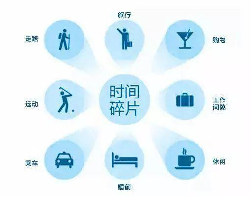

**不要用碎片化的时间去学习新知识！**

**不要用碎片化的时间去学习新知识！**

**不要用碎片化的时间去学习新知识！**

**重要的事情说三遍！**

#### 1.碎片化时间的陷阱

鼓吹用碎片化时间去学习的人，会告诉你：“**我们一天的时间里，有大量的碎片化时间，如果我们利用起来学习，我们得学会多少知识？**”

好像没错，上下班，至少得花了一小时的时间，睡前半个小时玩手机的时间…碎片化的时间，如此之多。

遗憾的是，假如哪一天自己心血来潮，开始利用碎片化时间学习一些新的知识的时候，就会发现，学习效率很低不说，还会学得越来越累，越来越没学习的兴趣。

为什么会这样？

坐地铁时，还在推算着昨天的一道数学题；睡觉前，还端着一本《算法导论》看得模棱两可的。

利用碎片化时间，学习这些十分“烧脑”的知识，需要持续的思考，碎片化的时间，又非常不利于“持续”二字。此外，它还会耗费许多精力，等真正到了该学习的时间，就特别容易精疲力竭。

很多人明白这个道理，却很难做到，总是在碎片化的时间里，用来学习新知识。

利用碎片化时间学习，还会<b>丢失真正的“思考”的时间</b>。

#### 2.成功者都爱思考

每一个极其成功的人，都会用很多时间去思考。

> 阿基米德可以站在海边思考一整天，却丝毫没有感觉到饿；  
> 牛顿每天醒来，都要在床边沉思科研问题，直至中午就餐；  
>……

著名企业家稻盛和夫在《活法》里，也有着类似的描述-**睡也想、醒也想，持续的愿望最重要**。

> 愿望要变为现实，普通程度的、随便想想的愿望是不够的，必须是“非同寻常的、强烈的愿望”，这一点很重要。“如果能那样该多好啊”这种淡然的、可有可无的、不迫切的愿望不行。愿望强烈的程度，促使你睡也想、醒也想，一天24小时不断地思考，透彻地思考。全身充满了这种愿望，如果从身上某处切开，流出来的不是血，而是这种“愿望”。抱着这样的愿望，聚精会神地、一心一意地、强烈而透彻地进行思考，这就是事业成功的原动力。

思考，能带给我们什么好处？

**思考可以帮我们巩固和总结，提高学习效率**

> “昨天背了20多个英文单词，一个也没记住？是什么原因？”  
> “前天学了html几个标签，回忆一下，看是不是记住了”

**思考是规划，今天要做什么，明天有什么计划，这个阶段的目标，还差多少完成？**

**思考还可以让我们拥有积极的心态，进而转化为学习的动力**

>“当我熟练掌握了英语，我就突破语言壁垒，和外国人进行无障碍交流啦，对话的场景是这个样子的……”  
>“等我学会了这些基础知识，再掌握几个框架，我就能成为一名合格的前端工程师！加油！”

#### 3.碎片化时间，还是将时间碎片化

现在，问一下自己“**我是在利用碎片化时间？还是将时间碎片化了？**”

之前W3Cschool开过一次内部会议，让我印象颇深。boss就当着全体同事的面，说了几句话，大意如下：

>工作的时候，要想尽办法提高效率，怎么提高效率？如果要求你们8小时内，全部集中精力做事，那不可能，我自己都做不到。要是能有6小时集中注意力，那就算是优秀的了。  
>工作的时候，<b>最怕的就是把自己的时间，碎片化了</b>，一小时时间，要做这，又要做那，结果效率肯定是奇低的。不论工作还是学习，<b>整块的使用时间，是提高学习效率的保障</b>。

学习也是如此，今天打算花两小时学习，用了20分钟复习，真正用在学习的时间，就只有1小时40分钟。这两小时的学习时间，被拆分成了复习+学习，时间被碎片化了。

而聪明人的做法是，利用坐公交20分钟的时间复习，再用完整的2个小时的时间学习。这才是真的在利用碎片化时间。

#### 4.你的碎片化时间都在…

如何利用碎片化的时间，没有标准答案，每个人都可能做出不同的选择。

你可以用碎片化的时间，刷刷抖音、知乎，也可以用来打一局吃鸡、王者荣耀……

我们发现，绝大部分人的碎片化时间，都用来做一些大脑认为简单，或者能让大脑感觉到愉悦的事情。显然，学习那些很难的知识，违背了这一点。

如果你真的想将碎片化时间用来学习，当然是件好事，值得赞扬，但学习的内容，一定要往**简单**的方向靠拢。

为什么要“简单”呢？

因为碎片化的时间学习，是很难控制什么时候结束的，这就会让终值和峰值，处于不可控状态，万一终值和峰值以“太难”结束，整个学习过程会很不愉快的，容易使人丧失学习兴趣。

（关于学习峰值和终值的描述，请点击：[给你这么多学习资源，为什么你会“收藏不看，已成习惯？”](https://mp.weixin.qq.com/s?__biz=MzIyMTQ4OTM3NQ==&mid=2247489939&idx=1&sn=353aee677e4628232e3afff4e995e39b&chksm=e83aa823df4d2135182a3e9c119cb1da3bb653166c68022d9096474d605295167eac2144e6d8&scene=21#wechat_redirect "给你这么多学习资源，为什么你会“收藏不看，已成习惯？”")）