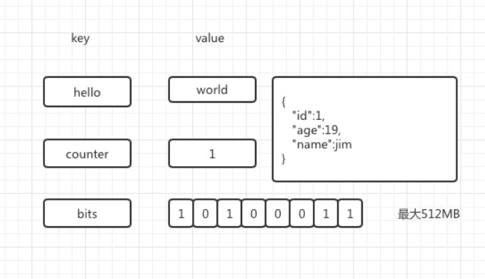
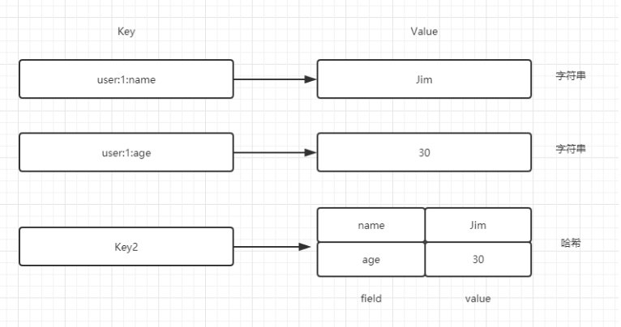
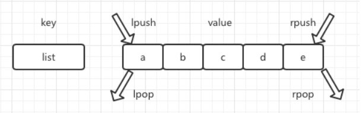
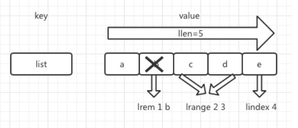
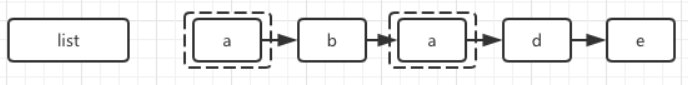

Redis 中有 5 种数据结构，分别是字符串（String）、哈希（Hash）、列表（List）、集合（Set）和有序集合（Sorted Set），因为使用 Redis 场景的开发中肯定是无法避开这些基础结构的，所以熟练掌握它们也就成了一项必不可少的能力。本文章精要地介绍了 Redis 的这几种数据结构，主要覆盖了它们各自的定义、基本用法与相关要点。

## 字符串类型
字符串是 Redis 中的最基础的数据结构，我们保存到 Redis 中的 key，也就是键，就是字符串结构的。除此之外，Redis 中其它数据结构也是在字符串的基础上设计的，可见字符串结构对于 Redis 是多么重要。

Redis 中的字符串结构可以保存多种数据类型，如：简单的字符串、JSON、XML、二进制等，但有一点要特别注意：在 Redis 中字符串类型的值最大只能保存 512 MB。
[](./14-Redis五种数据结构学习/1.jpg "Redis五种数据结构学习-1")
### 命令
下面通过命令了解一下对字符串类型的操作：

#### 1.设置值
`set key value [EX seconds] [PX milliseconds] [NX|XX]`
```bash
panchao@panchao-virtual-machine:~$
panchao@panchao-virtual-machine:~$ redis-cli
127.0.0.1:6379> set hello world
OK
127.0.0.1:6379>
```
set 命令有几个非必须的选项，下面我们看一下它们的具体说明：

- EX seconds：为键设置秒级过期时间
- PX milliseconds：为键设置毫秒级过期时间
- NX：键必须不存在，才可以设置成功，用于添加
- XX：键必须存在，才可以设置成功，用于更新
```bash
127.0.0.1:6379> exists name
(integer) 1
127.0.0.1:6379> set name zhaozilong
OK
127.0.0.1:6379> setnx name zhaozilong
(integer) 0
127.0.0.1:6379> set name zhangfei xx
OK
127.0.0.1:6379> set pcgrw pcgrw xx
(nil)
127.0.0.1:6379> set pcgrw pcgrw XX
(nil)
127.0.0.1:6379> get pcgrw
(nil)
127.0.0.1:6379> setnx pcgrw pcgrw.com
(integer) 1
127.0.0.1:6379> setnx pcgrw.com pcgrw.com
(integer) 1
127.0.0.1:6379> 
```
set 命令带上可选参数 NX 和 XX 在实际开发中的作用与 setnx 和 setxx 命令相同。我们知道 setnx 命令只有当 key 不存在的时候才能设置成功，换句话说，也就是同一个 key 在执行 setnx 命令时，只能成功一次，并且由于 Redis 的单线程命令处理机制，即使多个客户端同时执行 setnx 命令，也只有一个客户端执行成功。所以，基于 setnx 这种特性，**setnx 命令可以作为分布式锁的一种解决方案。**

而 setxx 命令则可以在安全性比较高的场景中使用，因为 set 命令执行时，会执行覆盖的操作，而 setxx 在更新 key 时可以确保该 key 已经存在了，所以为了保证 key 中数据类型的正确性，可以使用 setxx 命令。

#### 2.获取值
`get key`
```bash
127.0.0.1:6379> exists name
(integer) 1
127.0.0.1:6379> get name
"zhangfei"
127.0.0.1:6379>
```
#### 3.批量设置值
`mset key value [key value ...]`
```bash
127.0.0.1:6379> mset name 张三 sex 男 age 18
OK
127.0.0.1:6379>
```
#### 4.批量获取值
`mget key [key ...]`
```bash
127.0.0.1:6379> mget name sex age
1) "\xe5\xbc\xa0\xe4\xb8\x89"
2) "\xe7\x94\xb7"
3) "18"
127.0.0.1:6379>
```
如果有些键不存在，那么它的值将为 nil，也就是空，并且返回结果的顺序与传入时相同。
```bash
127.0.0.1:6379> mget name sex age asdf
1) "\xe5\xbc\xa0\xe4\xb8\x89"
2) "\xe7\x94\xb7"
3) "18"
4) (nil)
127.0.0.1:6379> 
```
#### 5.计数
`incr key`

incr 命令用于对值做自增操作，返回的结果分为 3 种情况：

- 如果值不是整数，那么返回的一定是错误
- 如果值是整数，那么返回自增后的结果
- 如果键不存在，那么就会创建此键，然后按照值为 0 自增， 就是返回 1
```bash
127.0.0.1:6379> incr name
(error) ERR value is not an integer or out of range
127.0.0.1:6379> set count 5
OK
127.0.0.1:6379> incr count
(integer) 6
127.0.0.1:6379> get count
"6"
127.0.0.1:6379> incr count1
(integer) 1
127.0.0.1:6379> get count1
"1"
127.0.0.1:6379>
```
除了有 incr 自增命令外，Redis 中还提供了其它对数字处理的命令。例如：

- decr key 自减
- incrby kek increment 自增指定数字
- decrby key decrement 自减指定数字
- incrbyfloat key increment 自增浮点数
```bash
127.0.0.1:6379> incrby num 11
(integer) 11
127.0.0.1:6379> incrby num 11
(integer) 22
127.0.0.1:6379> decrby num 10
(integer) 12
127.0.0.1:6379> decrby num 10
(integer) 2
127.0.0.1:6379> decr num
(integer) 1
127.0.0.1:6379> incrbyfloat num1 12.12
"12.12"
127.0.0.1:6379> incrbyfloat num1 12.12
"24.24"
```
#### 6.追加值
`append key value`

append 命令可以向字符串尾部追加值。
```bash
127.0.0.1:6379> set str hello
OK
127.0.0.1:6379> get str
"hello"
127.0.0.1:6379> append str  world
(integer) 10
127.0.0.1:6379> get str
"helloworld"
127.0.0.1:6379>
```
#### 7.字符串长度
`strlen key`
```bash
127.0.0.1:6379> strlen str
(integer) 10
127.0.0.1:6379>
127.0.0.1:6379> set str 字符串
OK
127.0.0.1:6379> strlen str
(integer) 9
127.0.0.1:6379>
```
由于每个中文占用 3 个字节，所以 str 这个键，返回是字符串长度为 9，而不是 3。
#### 8.设置并返回原值
`getset key value`
```bash
127.0.0.1:6379> get str
"helloworld1"
127.0.0.1:6379> getset str hello
"helloworld1"
127.0.0.1:6379>
```
#### 9.设置指定位置的字符
`setrange key offset value`
```bash
127.0.0.1:6379> set yuming pcgrw.com
OK
127.0.0.1:6379> get yuming
"pcgrw.com"
127.0.0.1:6379> setrange yuming 5 |
(integer) 9
127.0.0.1:6379> get yuming
"pcgrw|com"
127.0.0.1:6379>
```
#### 10.获取部分字符串
`getrange key start end`
```bash
127.0.0.1:6379> set yuming pcgrw|com
OK
127.0.0.1:6379> getrange yuming 0 4
"pcgrw"
127.0.0.1:6379>
```
#### 时间复杂度

在 Redis 中执行任何命令时，都有相应的时间复杂度，复杂度越高也就越费时间，所以在执行 Redis 中的命令时，如果要执行的命令复杂度越高，就越要慎重。下面是字符串命令时间复杂度类型表：

| 命令  | 时间复杂度  |
| ------------ | ------------ |
| set key value  | O(1)  |
| get key  | O(1)  |
| del key  | O(k) k是键的个数  |
| mset key value  | O(k) k是键的个数  |
| mget key  | O(k) k是键的个数  |
| incr key  | O(1)  |
| decr key  | O(1)  |
| incrby key increment  | O(1)  |
| decrby keky increment  | O(1)  |
| incrbyfloat key iincrement  | O(1)  |
| append key value  | O(1)  |
| strlen key  | O(1)  |
| setrange key offset value  | O(1)  |
| getrange key start end  | O(n) n是字符串长度  |

#### 内部编码
在 Redis 中字符串类型的内部编码有 3 种：

- int：8 个字节的长整型
- embstr：小于等于 39 个字节的字符串
- raw：大于 39 个字节的字符串
```bash
127.0.0.1:6379> set key 1
OK
127.0.0.1:6379> object encoding key
"int"
127.0.0.1:6379> set key hello
OK
127.0.0.1:6379> object encoding key
"embstr"
127.0.0.1:6379> set key hellohellohellohellohellohellohellohellohell
OK
127.0.0.1:6379> object encoding key
"embstr"
127.0.0.1:6379> set key hellohellohellohellohellohellohellohellohello
OK
127.0.0.1:6379> object encoding key
"raw"
```
## 哈希类型
大部分语言基本都提供了哈希类型，如 Java 语言中的 Map 类型及 Python 语言中的字典类型等等。虽然语言不同，但它们基本使用都是一样的，也就是都是键值对结构的。例如：

`value={{field1, value1}`

通过下图可以直观感受一下字符串类型和哈希类型的区别：
[](./14-Redis五种数据结构学习/2.jpg "Redis五种数据结构学习-2")
Redis 中哈希类型都是键值对结构的，所以要特别注意这里的 value 并不是指 Redis 中 key 的 value，而是哈希类型中的 field 所对应的 value。

### 命令
下面我们还是和介绍字符串类型一样，了解一下 Redis 中哈希类型的相关命令。
#### 1.设置值
`hset key field value`
```bash
127.0.0.1:6379> hset zilong name zilong
(integer) 1
127.0.0.1:6379> hset zilong name zilong
(integer) 0
127.0.0.1:6379> hsetnx zilong name zilong
(integer) 0
127.0.0.1:6379> hsetnx zilong sex nan
(integer) 1
127.0.0.1:6379>
```
我们看上图执行的命令知道，hset 命令也是有返回值的。如果 hset 命令设置成功，则返回 1，否则返回 0。除此之外 Redis 也为哈希类型提供了 hsetnx 命令。在前文对字符串的介绍中，我们知道 nx 命令只有当 key 不存在的时候，才能设置成功，同样的，hsetnx 命令在 field 不存在的时候，才能设置成功。
#### 2.获取值
`hget key field`
```bash
127.0.0.1:6379> hget zilong name
"zilong"
127.0.0.1:6379> hget zilong name3
(nil)
127.0.0.1:6379>
```
我们看 hget 命令和 get 有很大的不同，get 命令在获取的时候，只要写一个名字就可以了，而 hget 命令则要写两个名字，第一个名字是 key，第二个名字是 field。当然 key 或者 field 不存在时，返回的结果都是 nil。
#### 3.删除 field
`hdel key field [field ...]`
```bash
127.0.0.1:6379> hget zilong name
"zilong"
127.0.0.1:6379> hget zilong sex
"nan"
127.0.0.1:6379> hdel zilong name sex
(integer) 2
127.0.0.1:6379>
```
hdel 命令删除的时候，也会有返回值，并且这个返回就是成功删除 field 的个数。当 field 不存在时，并不会报错，而是直接返回 0。
#### 4.计算 field 个数
`hlen key`
```bash
127.0.0.1:6379> hlen zilong
(integer) 0
127.0.0.1:6379> hset zilong name zilong
(integer) 1
127.0.0.1:6379> hlen zilong
(integer) 1
127.0.0.1:6379>
```
#### 5.批量设置或获取 field-value
```bash
hmget key field [field ...]
hmset key field value [field value ...]
```
```bash
127.0.0.1:6379> hmset zilong sex nan age 18
OK
127.0.0.1:6379> hmget zilong name sex name hight
1) "zilong"
2) "nan"
3) "zilong"
4) (nil)
127.0.0.1:6379>
```
hmset 命令和 hmget 命令分别是批量设置和获取值的，hmset 命令没有什么要注意的，但 hmget 命令要特别注意，当我们获取一个不存在的 key 或者不存在的 field 时，Redis 并不会报错，而是返回 nil。并且有几个 field 不存在，则 Redis 返回几个 nil。
#### 6.判断 field 是否存在
`hexists key field`
```bash
127.0.0.1:6379> hexists zilong name
(integer) 1
127.0.0.1:6379> hexists zilong name1
(integer) 0
127.0.0.1:6379>
```
当执行 hexists 命令时，如果当前 key 包括 field，则返回 1，否则返回 0。
#### 7.获取所有 field
`hkeys key`
```bash
127.0.0.1:6379> hkeys zilong
1) "name"
2) "sex"
3) "age"
127.0.0.1:6379>
```
#### 8.获取所有 value
`hvals key`
```bash
127.0.0.1:6379> hvals zilong
1) "zilong"
2) "nan"
3) "18"
127.0.0.1:6379>
```
#### 9.获取所有的 field-value
`hgetall key`
```bash
127.0.0.1:6379> hgetall zilong
1) "name"
2) "zilong"
3) "sex"
4) "nan"
5) "age"
6) "18"
127.0.0.1:6379>
```
hgetall 命令会返回当前 key 中的所有 field-value，并按照顺序依次返回。
#### 10.计数
```bash
hincrby key field increment
hincrbyfloat key field increment
```
```bash
127.0.0.1:6379> hincrby zilong age 2
(integer) 20
127.0.0.1:6379> hincrbyfloat zilong age 2.1
"22.1"
127.0.0.1:6379>
```
hincrby 命令和 incrby 命令的使用功能基本一样，都是对值进行增量操作的，唯一不同的就是 incrby 命令的作用域是 key，而 hincrby 命令的作用域则是 field。
11.计算 value 的字符串长度
`hstrlen key field`
```bash
127.0.0.1:6379> hstrlen zilong name
(integer) 6
127.0.0.1:6379>
```
hstrlen 命令返回的是当前 key 中 field 中字符串的长度，如果当前 key 中没有 field 则返回 0。
#### 时间复杂度

| 命令  | 时间复杂度  |
| ------------ | ------------ |
| hset key field value  | O(1)  |
| hget key field  | O(1)  |
| hdel key field [field ...]  | O(k) ，k是field个数  |
| hlen key  | O(1)  |
| hgetall key  | O(n) ，n是field总数  |
| hmget key field [field ...]  | O(k) ，k是field个数  |
| hmset key field value [field value ...]  | O(k) ，k是field个数  |
| hexists key field  | O(1)  |
| hkeys key  | O(n) ，n是field总数  |
| hvals key  | O(n) ，n是field总数  |
| hsetnx key field value  | O(1)  |
| hincrby key field increment  | O(1)  |
| hincrbyfloat key field increment  | O(1)  |
| hstrlen key field  | O(1)  |
#### 内部编码
Redis 哈希类型的内部编码有两种，它们分别是：

- ziplist（压缩列表）：当哈希类型中元素个数小于 hash-max-ziplist-entries 配置（默认 512 个），同时所有值都小于 hash-max-ziplist-value 配置（默认 64 字节）时，Redis 会使用 ziplist 作为哈希的内部实现。
- hashtable（哈希表）：当上述条件不满足时，Redis 则会采用 hashtable 作为哈希的内部实现。
下面我们通过以下命令来演示一下 ziplist 和 hashtable 这两种内部编码。

当 field 个数比较少并且 value 也不是很大时候 Redis 哈希类型的内部编码为 ziplist：
```bash
127.0.0.1:6379> hmset linglong name linglong sex nv
OK
127.0.0.1:6379> object encoding linglong
"ziplist"
127.0.0.1:6379>
```
当 value 中的字节数大于 64 字节时（可以通过 hash-max-ziplist-value 设置），内部编码会由 ziplist 变成 hashtable。
```bash
127.0.0.1:6379> hset zilong desc '阿斯顿发生䠳dfasfasfasfasfasfasfa啊手动阀手动阀书法书法大赛撒旦发生发生飞洒发的啊手动阀沙发党发顺丰的大师傅撒发生发生sf生发'
127.0.0.1:6379> object encoding zilong
"hashtable"
127.0.0.1:6379>
```
当 field 个数超过 512（可以通过 hash-max-ziplist-entries 参数设置），内部编码也会由 ziplist 变成 hashtable。

由于直接手动创建 512 个 field 不方便，为了更好的验证该功能，我将用程序的方式，动态创建 512 个 field 来验证此功能，下面为具体的代码：
```python
import redis
  
r = redis.Redis(host='127.0.0.1',port=6379)
print('key为【userInfo】的字节编码为【%s】' %(r.object('encoding','userInfo')))
for i in range(1,514):
    r.hset('userInfo',str(i),'test'+str(i))
print('key为【userInfo】的字节编码为【%s】' %(r.object('encoding','userInfo')))
```
打印结果：
```bash
key为【userInfo】的字节编码为【b'ziplist'】
key为【userInfo】的字节编码为【b'hashtable'】
```
## 列表类型
Redis 中列表类型可以简单地理解为存储多个有序字符串的一种新类型，这种类型除了字符串类型中已有的功能外，还提供了其它功能，如可以对列表的两端插入和弹出元素（在列表中的字符串都可以称之为元素），除此之外还可以获取指定的元素列表，并且还可以通过索引下标获取指定元素等等。下面我们通过下图来看一下 Redis 中列表类型的插入和弹出操作：
[](./14-Redis五种数据结构学习/3.jpg "Redis五种数据结构学习-3")

下面我们看一下 Redis 中列表类型的获取与删除操作：
[](./14-Redis五种数据结构学习/4.jpg "Redis五种数据结构学习-4")

Redis 列表类型的特点如下：

- 列表中所有的元素都是有序的，所以它们是可以通过索引获取的，也就是上图中的 lindex 命令。并且在 Redis 中列表类型的索引是从 0 开始的。
- 列表中的元素是可以重复的，也就是说在 Redis 列表类型中，可以保存同名元素，如下图所示：
[](./14-Redis五种数据结构学习/5.jpg "Redis五种数据结构学习-5")
### 命令
下面我们还是和学习其它数据类型一样，我们还是先学习一下 Redis 列表类型的命令。
#### 1.添加操作
- 从右边插入元素

`rpush key value [value ...]`
```bash
127.0.0.1:6379> rpush list 1 2 3
(integer) 3
127.0.0.1:6379> lrange list 0 -1
1) "1"
2) "2"
3) "3"
127.0.0.1:6379>
```
我们看 rpush 命令在插入时，是有返回值的，返回值的数量就是当前列表中所有元素的个数。

我们也可以用下面的命令从左到右获取当前列表中的所有的元素，也就是如上图所示中那样。
`lrange 0 -1`

- 从左边插入元素

`lpush key value [value ...]`
```bash
127.0.0.1:6379> lpush list a b c
(integer) 6
127.0.0.1:6379> lrange list 0 -1
1) "c"
2) "b"
3) "a"
4) "1"
5) "2"
6) "3"
127.0.0.1:6379>
```
lpush 命令的返回值及用法和 rpush 命令一样。通过上面的事例证明了我们前面说的，rpush 命令和 lpush 命令的返回值并不是当前插入元素的个数，而是当前 key 中全部元素的个数，因为当前 key 中已经有了 3 个元素，所以我们在执行插入命令时，返回的就是 6 而不是 3。

- 向某个元素前或者后插入元素

`linsert key BEFORE|AFTER pivot value`
```bash
127.0.0.1:6379> linsert list before 1 0
(integer) 7
127.0.0.1:6379> lrange list 0 -1
1) "c"
2) "b"
3) "a"
4) "0"
5) "1"
6) "2"
7) "3"
127.0.0.1:6379> linsert list after a z
(integer) 8
127.0.0.1:6379> lrange list 0 -1
1) "c"
2) "b"
3) "a"
4) "z"
5) "0"
6) "1"
7) "2"
8) "3"
127.0.0.1:6379>
```
linsert 命令在执行的时候首先会从当前列表中查找到 pivot 元素，其次再将这个新元素插入到 pivot 元素的前面或者后面。并且我们通过上图可以知道 linsert 命令在执行成功后也是会有返回值的，返回的结果就是当前列表中元素的个数。
#### 2.查找

- 获取指定范围内的元素列表

`lrange key start stop`
```bash
127.0.0.1:6379> lrange list 0 7
1) "c"
2) "b"
3) "a"
4) "z"
5) "0"
6) "1"
7) "2"
8) "3"
127.0.0.1:6379>
```
lrange 命令会获取列表中指定索引范围的所有元素。

通过索引获取列表主要有两个特点：

- 索引下标从左到右分别是 0 到 N-1，从右到左是 -1 到 -N。
- lrange 命令中的 stop 参数在执行时会包括当前元素，并不是所有的语言都是这样的。我们要获取列表中前两个元素则可以如下图所示：
```bash
127.0.0.1:6379> lrange list 0 1
1) "c"
2) "b"
127.0.0.1:6379>
```

- 获取列表中指定索引下标的元素

`lindex key index`
```bash
127.0.0.1:6379> lindex list 4
"0"
127.0.0.1:6379>
```

- 获取列表长度

`llen key`
```bash
127.0.0.1:6379> llen list
(integer) 8
127.0.0.1:6379>
```
#### 3.删除

- 从列表左侧弹出元素

`lpop key`
```bash
127.0.0.1:6379> lrange list 0 -1
1) "c"
2) "b"
3) "a"
4) "z"
5) "0"
6) "1"
7) "2"
8) "3"
127.0.0.1:6379> lpop list 
"c"
127.0.0.1:6379> lrange list 0 -1
1) "b"
2) "a"
3) "z"
4) "0"
5) "1"
6) "2"
7) "3"
127.0.0.1:6379>
```
lpop 命令执行成功后会返回当前被删除的元素名称。

- 从列表右侧弹出元素

`rpop key`
```bash
127.0.0.1:6379> lrange list 0 -1
1) "b"
2) "a"
3) "z"
4) "0"
5) "1"
6) "2"
7) "3"
127.0.0.1:6379> rpop list
"3"
127.0.0.1:6379> lrange list 0 -1
1) "b"
2) "a"
3) "z"
4) "0"
5) "1"
6) "2"
127.0.0.1:6379>
```
rpop 命令和 lpop 命令的使用方式一样。

- 删除指定元素

`lrem key count value`

lrem 命令会将列表中等于 value 的元素删除掉，并且会根据 count 参数来决定删除 value 的元素个数。

下面我们看一下 count 参数的使用说明：

count > 0：表示从左到右，最多删除 count 个元素。也就是如下图所示：
```bash
127.0.0.1:6379> lrange list 0 -1
1) "b"
2) "a"
3) "z"
4) "0"
5) "1"
6) "2"
127.0.0.1:6379> lrem list 5 0
(integer) 1
127.0.0.1:6379>
```
我们看上图中的命令中，虽然我们将 count 参数指定的是 5，将 value 参数指定的是 0，但由于当前列表中只有一个 0，所以，当前 lrem 命令最多只能删除 1 个元素，并且 lrem 命令也是有返回值的，也就是当前成功删除元素的个数。
```bash
127.0.0.1:6379> lpush list 1 1 1 1 1 1 1
(integer) 12
127.0.0.1:6379> lrange list 0 -1
 1) "1"
 2) "1"
 3) "1"
 4) "1"
 5) "1"
 6) "1"
 7) "1"
 8) "b"
 9) "a"
10) "z"
11) "1"
12) "2"
127.0.0.1:6379> lrem list 5 1
(integer) 5
127.0.0.1:6379> lrange list 0 -1
1) "1"
2) "1"
3) "b"
4) "a"
5) "z"
6) "1"
7) "2"
127.0.0.1:6379>
```
count < 0：从右到左，最多删除 count 个元素。
```bash
127.0.0.1:6379> rpush list 1 1 1 1 1
(integer) 12
127.0.0.1:6379> lrange list 0 -1
 1) "1"
 2) "1"
 3) "b"
 4) "a"
 5) "z"
 6) "1"
 7) "2"
 8) "1"
 9) "1"
10) "1"
11) "1"
12) "1"
127.0.0.1:6379> lrem list -5 1
(integer) 5
127.0.0.1:6379> lrange list 0 -1
1) "1"
2) "1"
3) "b"
4) "a"
5) "z"
6) "1"
7) "2"
127.0.0.1:6379>
```
count = 0：删除所有元素。
```bash
127.0.0.1:6379> lrange list 0 -1
1) "1"
2) "1"
3) "b"
4) "a"
5) "z"
6) "1"
7) "2"
127.0.0.1:6379> lrem list 0 1
(integer) 3
127.0.0.1:6379> lrange list 0 -1
1) "b"
2) "a"
3) "z"
4) "2"
127.0.0.1:6379>
```

- 按照索引范围修剪列表

`ltrim key start stop`

ltrim 命令会直接保留 start 索引到 stop 索引的之间的元素，并包括当前元素，而之外的元素则都会删除掉，所以该命令也叫修剪列表。
```bash
127.0.0.1:6379> lrange list 0 -1
1) "b"
2) "a"
3) "z"
4) "2"
127.0.0.1:6379> ltrim list 1 2
OK
127.0.0.1:6379> lrange list 0 -1
1) "a"
2) "z"
127.0.0.1:6379>
```
并且有一点要注意，ltrim 命令不会返回当前的列表中元素的个数，而是返回改命令是否成功的状态。

#### 4.修改

- 修改指定索引下标的元素

`lset key index value`
```bash
127.0.0.1:6379> lrange list 0 -1
1) "a"
2) "z"
127.0.0.1:6379> lset list 0 y
OK
127.0.0.1:6379> lrange list 0 -1
1) "y"
2) "z"
127.0.0.1:6379>
```
#### 5.阻塞操作
```bash
blpop key [key ...] timeout
brpop key [key ...] timeout
```
blpop 和 brpop 命令是 lpop 和 rpop 命令的阻塞版本，它们除了弹出方向不同以外，使用方法基本相同。

- key [key ...]：可以指定多个列表的键。
- timeout：阻塞时间（单位：秒）

下面我们看一下该命令的详细使用。

**列表为空**：如果 timeout=3，则表示客户端等待 3 秒后才能返回结果，如果 timeout=0，则表示客户端会一直等待，也就是会阻塞。
```bash
127.0.0.1:6379> blpop list 3
1) "list"
2) "y"
127.0.0.1:6379> lrange list 0 -1
1) "z"
127.0.0.1:6379> brpop list 0
1) "list"
2) "z"
127.0.0.1:6379> brpop list 0
1) "list"
2) "1"
(33.05s)
```
由于我期间向列表中插入了元素，否则上述命令将一直阻塞下去。

**列表不为空**：如果 timeout=0，并且列表不为空时，则 blpop 和 brpop 命令会立即返回结果，不会阻塞。

下面我们看一下 blpop 和 brpop 命令的注意事项。

如果使用 blpop 和 brpop 命令指定多个键时，blpop 和 brpop 命令会从左到右遍历键，并且一旦有一个键能返回元素，则客户端会立即返回。
```bash
127.0.0.1:6379> blpop list list1 list2 0
1) "list1"
2) "c"
127.0.0.1:6379> blpop list list1 list2 0
1) "list1"
2) "b"
127.0.0.1:6379> blpop list list1 list2 0
1) "list1"
2) "a"
127.0.0.1:6379> blpop list list1 list2 0
1) "list"
2) "1"
(6.51s)
127.0.0.1:6379>
```
当列表为空时，上述命令会阻塞，如果向上述中的任何一个键中插入元素，则上述命令会直接返回该键的元素。

如果多个客户端都对同一个键执行 blpop 或者 brpop 命令，则最先执行该命令的客户端会获取到该键的元素。

我同时启动了 3 个客户端，因为当前列表为空，所以上述命令执行后会阻塞。如果此时我向该列表中插入元素，则只有第一个客户端会有返回结果，因为第一个客户端是第一个执行上述命令的。

#### 时间复杂度
下面我们看一下列表中命令的相关时间复杂度。

| 操作类型  | 命令  | 时间复杂度  |
| ------------ | ------------ | ------------ |
| 添加  | rpush key value [value ...]  | O(k)，k是元素的个数  |
| 添加  | lpush key value [value ...]  | O(k)，k是元素的个数  |
| 添加  | linsert key BEFORE/AFTER pivot value  | O(n)，n是pivot距离列表头或者尾的距离  |
| 查找  | lrange key start stop  | O(s + n)，s是start偏移量，n是start到stop的范围  |
| 查找  | lindex key index  | O(n)，n是索引的偏移量  |
| 查找  | llen key  | O(1)  |
| 删除  | lpop key  | O(1)  |
| 删除  | rpop key  | O(1)  |
| 删除  | lrem key count value  | O(n)，n是列表长度  |
| 删除  | ltrim key start stop  | O(n)，n是要裁剪的元素个数  |
| 修改  | lset key index value  | O(n)，n是索引的偏移量  |
| 阻塞操作  | blpop/brpop key [key ...] timeout  | O(1)  |

#### 内部编码
列表中的内部编码有两种，它们分别是：

- ziplist（压缩列表）：当列表中元素个数小于 512（默认）个，并且列表中每个元素的值都小于 64（默认）个字节时，Redis 会选择用 ziplist 来作为列表的内部实现以减少内存的使用。当然上述默认值也可以通过相关参数修改：list-max-ziplist-entried（元素个数）、list-max-ziplist-value(元素值)。
- linkedlist（链表）：当列表类型无法满足 ziplist 条件时，Redis 会选择用 linkedlist 作为列表的内部实现。

## 集合类型
Redis 中的集合类型，也就是 set。在 Redis 中 set 也是可以保存多个字符串的，经常有人会分不清 list 与 set，下面我们重点介绍一下它们之间的不同：

- set 中的元素是不可以重复的，而 list 是可以保存重复元素的。
- set 中的元素是无序的，而 list 中的元素是有序的。
- set 中的元素不能通过索引下标获取元素，而 list 中的元素则可以通过索引下标获取元素。
- 除此之外 set 还支持更高级的功能，例如多个 set 取交集、并集、差集等。

### 命令
下面我们介绍一下 set 中的相关命令。
#### 1.集合内操作

- 添加元素

`sadd key member [member ...]`
```bash
127.0.0.1:6379> sadd setkey a b a
(integer) 2
127.0.0.1:6379>
```
sadd 命令也是有返回值的，它的返回值就是当前执行 sadd 命令成功添加元素的个数，因为 set 中不能保存重复元素，所以在执行 sadd setkey a b a 命令时，返回的是 2，而不是 3。因为元素 a 已经成功保存到 set 中，不能再保存了。

- 删除元素

`srem key member [member ...]`
```bash
127.0.0.1:6379> srem setkey a b
(integer) 2
127.0.0.1:6379> srem setkey c
(integer) 0
127.0.0.1:6379>
```
srem 命令和 sadd 命令一样也是有返回值的，返回值就是当前删除元素的个数。

- 计算元素个数

`scard key`
```bash
127.0.0.1:6379> scard setkey
(integer) 0
127.0.0.1:6379>
```
scard 命令的时间复杂度为O(1)，scard 命令不会遍历 set 中的所有元素，而是直接使用 Redis 中的内部变量。

- 判读元素是否在集合中

`sismember key member`
```bash
127.0.0.1:6379> sismember setkey a
(integer) 0
127.0.0.1:6379> sadd setkey a
(integer) 1
127.0.0.1:6379> sismember setkey a
(integer) 1
127.0.0.1:6379>
```
sismember 命令也有返回值，如果返回值为1则表示当前元素在当前 set 中，如果返回 0 则表示当前元素不在 set 中。

- 随机从 set 中返回指定个数元素

`srandmember key [count]`
```bash
127.0.0.1:6379> sadd setkey 1 2 3 4 5 6 7 8 9
(integer) 9
127.0.0.1:6379> srandmember setkey 3
1) "2"
2) "3"
3) "8"
127.0.0.1:6379> srandmember setkey 3
1) "4"
2) "6"
3) "3"
127.0.0.1:6379>
```
srandmember 命令中有一个可选参数 count，count 参数指的是返回元素的个数，如果当前 set 中的元素个数小于 count，则 srandmember 命令返回当前 set 中的所有元素，如果 count 参数等于 0，则不返回任何数据，如果 count 参数小于 0，则随机返回当前 count 个数的元素。

- 从集合中随机弹出元素

`spop key [count]`
```bash
127.0.0.1:6379> spop setkey
"7"
127.0.0.1:6379> spop setkey 3
1) "2"
2) "6"
3) "3"
127.0.0.1:6379>
```
spop 命令也是随机从 set 中弹出元素，并且也支持 count 可选参数，但有一点和 srandmember 命令不同。spop 命令在随机弹出元素之后，会将弹出的元素从 set 中删除。

- 获取所有元素

`smembers key`
```bash
127.0.0.1:6379> smembers setkey
1) "1"
2) "4"
3) "5"
4) "8"
5) "9"
127.0.0.1:6379>
```
smembers 命令虽然能获取当前 set 中所有的元素，但返回元素的顺序与 sadd 添加元素的顺序不一定相同，这也就是前面提到过的保存在 set 中的元素是无序的。
#### 2.集合间操作

- 集合的交集

`sinter key [key ...]`
```bash
127.0.0.1:6379> smembers setkey
1) "1"
2) "4"
3) "5"
4) "8"
5) "9"
127.0.0.1:6379> smembers setkey1
1) "1"
2) "2"
3) "3"
4) "4"
5) "5"
6) "6"
127.0.0.1:6379> sinter setkey setkey1
1) "1"
2) "4"
3) "5"
127.0.0.1:6379>
```

- 集合的并集

`sunion key [key ...]`
```bash
127.0.0.1:6379> sunion setkey setkey1
1) "1"
2) "2"
3) "3"
4) "4"
5) "5"
6) "6"
7) "8"
8) "9"
127.0.0.1:6379>
```

- 集合的差集

`sdiff key [key ...]`
```bash
127.0.0.1:6379> sdiff setkey setkey1
1) "8"
2) "9"
127.0.0.1:6379> sdiff setkey1 setkey
1) "2"
2) "3"
3) "6"
127.0.0.1:6379>
```

- 将集合的交集、并集、差集的结果保存

```bash
sinterstore destination key [key ...]
sunionstore destination key [key ...]
sdiffstore destination key [key ...]
```
```bash
127.0.0.1:6379> sinterstore intersection setkey setkey1
(integer) 3
127.0.0.1:6379> sunionstore union setkey setkey1
(integer) 8
127.0.0.1:6379> sdiffstore difference setkey setkey1
(integer) 2
127.0.0.1:6379> sdiffstore difference1 setkey1 setkey
(integer) 3
127.0.0.1:6379> smembers intersection
1) "1"
2) "4"
3) "5"
127.0.0.1:6379> smembers union
1) "1"
2) "2"
3) "3"
4) "4"
5) "5"
6) "6"
7) "8"
8) "9"
127.0.0.1:6379> smembers difference
1) "8"
2) "9"
127.0.0.1:6379> smembers difference1
1) "2"
2) "3"
3) "6"
127.0.0.1:6379>
```
为什么 Redis 要提供 sinterstore、sunionstore、sdiffstore 命令来将集合的交集、并集、差集的结果保存起来呢？这是因为 Redis 在进行上述比较时，会比较耗费时间，所以为了提高性能可以将交集、并集、差集的结果提前保存起来，这样在需要使用时，可以直接通过 smembers 命令获取。

#### 时间复杂度
下面我们看一下 set 中相关命令的时间复杂度。

| 命令  | 时间复杂度  |
| ------------ | ------------ |
| sadd key member [member ...]  | O(k),k是元素的个数  |
| srem key member [member ...]  | O(k),k是元素的个数  |
| scard key  | O(1)  |
| sismember key member  | O(1)  |
| srandmember key [count]  | O(count)  |
| spop key [count]  | O(1)  |
| smembers key  | O(n),n是元素的总数  |
| sinter key [key ...]  | O(m * k)，k是多个集合中元素最少的个数，m是键个数  |
| sunion key [key ...]  | O(k)，k是多个元素个数和  |
| sdiff key [key ...]  | O(k)，k是多个元素个数和  |
| sinterstore destination key [key ...]  | O(m * k)，k是多个集合中元素最少的个数，m是键个数  |
| sunionstore destination key [key ...]  | O(k)，k是多个元素个数和  |
| sdiffstore destination key [key ...]  |  O(k)，k是多个元素个数和 |
#### 内部编码

- intset(整数集合)：当集合中的元素都是整数，并且集合中的元素个数小于 512 个时，Redis 会选用 intset 作为底层内部实现。
- hashtable(哈希表)：当上述条件不满足时，Redis 会采用 hashtable 作为底层实现。
备注：我们可以通过 set-max-intset-entries 参数来设置上述中的默认参数。
下面我们看一下具体的事例，来验证我们上面提到的内部编码。
当元素个数较少并且都是整数时，内部编码为 intset。
```bash
127.0.0.1:6379> smembers setkey
1) "1"
2) "4"
3) "5"
4) "8"
5) "9"
127.0.0.1:6379> object encoding setkey
"intset"
127.0.0.1:6379>
```
当元素不全是整数时，内部编码为 hashtable。
```bash
127.0.0.1:6379> smembers setkey1
1) "4"
2) "6"
3) "3"
4) "2"
5) "5"
6) "1"
7) "a"
127.0.0.1:6379> object encoding setkey1
"hashtable"
127.0.0.1:6379>
```
当元素个数超过 512 个时，内部编码为 hashtable。
```python
import redis
  
r=redis.Redis(host='127.0.0.1',port=6379)
if r.object('encoding','setkey') != None:
    print('Key为【setkey】的字节编码为【%s】' %(r.object('encoding', 'setkey')))
for i in range(1,600):
    r.sadd('setkey',i)
if r.object('encoding','setkey') != None:
    print('Key为【setkey】的字节编码为【%s】' %(r.object('encoding', 'setkey')))
```
打印结果为：
```bash
Key为【setkey】的字节编码为【b'intset'】
Key为【setkey】的字节编码为【b'hashtable'】
```
## 有序集合类型
看名字我们就知道，有序集合也是一种集合，并且这个集合还是有序的。列表也是有序的，那它和有序集合又有什么不同呢？有序集合的有序和列表的有序是不同的。列表中的有序指的的是插入元素的顺序和查询元素的顺序相同，而有序集合中的有序指的是它会为每个元素设置一个分数(score)，而查询时可以通过分数计算元素的排名，然后再返回结果。因为有序集合也是集合类型，所以有序集合中也是不插入重复元素的，但在有序集合中分数则是可以重复，那如果在有序集合中有多个元素的分数是相同的，这些重复元素的排名是怎么计算的呢？后边我们再做详细说明。

下面先看一下列表、集合、有序集合三种数据类型之间的区别：

| 数据结构  | 是否允许重复元素  | 是否有序  | 有序实现方式  | 应用场景  |
| ------------ | ------------ | ------------ | ------------ | ------------ |
| 列表  | 是  | 是  | 索引下标  | 时间轴、消息队列  |
| 集合  | 否  | 否  | 无  | 标签、社交  |
| 有序集合  | 否  | 是  | 分数  | 排行榜、社交  |

### 命令
#### 1.集合内操作

- 添加元素

`zadd key [NX|XX] [CH] [INCR] score member [score member ...]`
```bash
127.0.0.1:6379> zadd zkey 1 a 2 b 3 c 4 d 5 c
(integer) 4
127.0.0.1:6379>
```
zadd 命令也是有返回值的，返回值就是当前 zadd 命令成功添加元素的个数。zadd 命令有很多选填参数：

- nx: 元素必须不存在时，才可以设置成功。
- xx: 元素必须存在时，才可以设置成功。
- ch: 返回此命令执行完成后，有序集合元素和分数发生变化的个数
- incr: 对 score 做增加。

备注：由于有序集合相比集合提供了排序字段，正是因为如此也付出了相应的代价，sadd 的时间复杂度为 O(1)，而 zadd 的时间复杂度为O(log(n))。

- 计算成员个数

`zcard key`
```bash
127.0.0.1:6379> zcard zkey
(integer) 4
127.0.0.1:6379>
```

- 计算某个成员的分数

`zscore key member`
```bash
127.0.0.1:6379> zscore zkey a
"1"
127.0.0.1:6379> zscore zkey e
(nil)
127.0.0.1:6379>
```
在使用 zscore 命令时，如果 key 不存在，或者元素不存在时，该命令返回的都是(nil)。

- 计算成员的排名

```bash
zrank key member
zrevrank key member
```
```bash
127.0.0.1:6379> zrank zkey b
(integer) 1
127.0.0.1:6379> zrevrank zkey b
(integer) 2
127.0.0.1:6379>
```
zrank 命令是从分数低到高排名，而 zrevrank 命令则恰恰相反，从高到低排名。有一点要特别注意， zrank 和 zrevrank 命令与 zscore 是命令不同的，前者通过分数计算出最后的排名，而后者则是直接返回当前元素的分数。

- 删除元素

`zrem key member [member ...]`
```bash
127.0.0.1:6379> zrem zkey a
(integer) 1
127.0.0.1:6379>
```
返回的结果为成功删除元素的个数，因为 zrem 命令是支持批量删除的。

- 增加元素分数

`zincrby key increment member`
```bash
127.0.0.1:6379> zincrby zkey 10 b
"12"
127.0.0.1:6379>
```
虽然 zincrby 命令是增加元素分数的，但我们也可以指定负数，这样当前元素的分数，则会相减。

- 返回指定排名范围的元素

```bash
zrange key start stop [WITHSCORES]
zrevrange key start stop [WITHSCORES]
```
```bash
127.0.0.1:6379> zadd zkey1 1 a 2 b 3 c 4 d 5 e 6 f 7 g
(integer) 7
127.0.0.1:6379> zrange zkey1 1 4
1) "b"
2) "c"
3) "d"
4) "e"
127.0.0.1:6379> zrevrange zkey1 1 4
1) "f"
2) "e"
3) "d"
4) "c"
127.0.0.1:6379> zrevrange zkey1 1 4 WITHSCORES
1) "f"
2) "6"
3) "e"
4) "5"
5) "d"
6) "4"
7) "c"
8) "3"
127.0.0.1:6379>
```
zrange 命令是通过分数从低到高返回数据，而 zrevrange 命令是通过分数从高到低返回数据。如果执行命令时添加了 WITHSCORES 可选参数，则返回数据时会返回当前元素的分数。

- 返回指定分数范围的元素

```bash
zrangebyscore key min max [WITHSCORES] [LIMIT offset count]
zrevrangebyscore key max min [WITHSCORES] [LIMIT offset count]
```
```bash
127.0.0.1:6379> zrangebyscore zkey1 2 6
1) "b"
2) "c"
3) "d"
4) "e"
5) "f"
127.0.0.1:6379> zrevrangebyscore zkey1 6 2
1) "f"
2) "e"
3) "d"
4) "c"
5) "b"
127.0.0.1:6379> zrevrangebyscore zkey1 6 2 WITHSCORES
 1) "f"
 2) "6"
 3) "e"
 4) "5"
 5) "d"
 6) "4"
 7) "c"
 8) "3"
 9) "b"
10) "2"
127.0.0.1:6379>
```
min 和 max 参数还支持开区间(小括号)和闭区间(中括号)，同时我们还可以用 -inf 和 +inf 参数代表无限小和无限大。
```bash
127.0.0.1:6379> zrangebyscore zkey1 2 6
1) "b"
2) "c"
3) "d"
4) "e"
5) "f"
127.0.0.1:6379> zrangebyscore zkey1 2 (6
1) "b"
2) "c"
3) "d"
4) "e"
127.0.0.1:6379> zrangebyscore zkey1 -inf +inf
1) "a"
2) "b"
3) "c"
4) "d"
5) "e"
6) "f"
7) "g"
127.0.0.1:6379>
```

- 返回指定分数范围元素个数

`zcount key min max`
```bash
127.0.0.1:6379> zcount zkey1 2 6
(integer) 5
127.0.0.1:6379>
```

- 删除指定排名内的升序元素

`zremrangebyrank key start stop`
```bash
127.0.0.1:6379> zremrangebyrank zkey1 1 1
(integer) 1
127.0.0.1:6379> zrangebyscore zkey1 -inf +inf
1) "a"
127.0.0.1:6379>
```

- 删除指定分数范围元素

`zremrangebyrank key start stop`
```bash
127.0.0.1:6379> zremrangebyscore zkey1 2 6
(integer) 5
127.0.0.1:6379> zrangebyscore zkey1 -inf +inf
1) "a"
2) "g"
127.0.0.1:6379>
```
#### 2.集合间操作

- 交集

`zinterstore destination numkeys key [key ...] [WEIGHTS weight] [AGGREGATE SUM|MIN|MAX]`

zinterstore 命令参数比较多：

- destination：将交集的计算结果，保存到这个键中。
- numkeys：需要做交集计算键的个数。
- key [key ...]：需要做交集计算的键。
- WEIGHTS weight：每个键的权重，在做交集计算时，每个键中的分数值都会乘以这个权重，默认每个键的权重为 1。
- AGGREGATE SUM|MIN|MAX：计算成员交集后，分值可以按照 sum(和)、min(最小值)、max(最大值)做汇总，默认值为  sum。
```bash
127.0.0.1:6379> zadd zsetkey1 1 a 2 b 3 c
(integer) 3
127.0.0.1:6379> zadd zsetkey2 3 c 4 d 5 e
(integer) 3
127.0.0.1:6379> zinterstore destination1 2 zsetkey1 zsetkey2
(integer) 1
127.0.0.1:6379> zrange destination1 0 -1 WITHSCORES
1) "c"
2) "6"
127.0.0.1:6379>
```
下面我们将权重设置为 0.5，这样当计算交集后，有序集合中的元素分数将都会减半，并且使用 max 参数汇总。
```bash
127.0.0.1:6379> zinterstore destination2 2 zsetkey1 zsetkey2 WEIGHTS 1 0.5 AGGREGATE MAX
(integer) 1
127.0.0.1:6379> zrange destination2 0 -1
1) "c"
127.0.0.1:6379>
```

- 并集

`zunionstore destination numkeys key [key ...] [WEIGHTS weight] [AGGREGATE SUM|MIN|MAX]`
```bash
127.0.0.1:6379> zunionstore destination1 2 zsetkey1 zsetkey2 
(integer) 5
127.0.0.1:6379> zrange destination1 0 -1 WITHSCORES
 1) "a"
 2) "1"
 3) "b"
 4) "2"
 5) "d"
 6) "4"
 7) "e"
 8) "5"
 9) "c"
10) "6"
127.0.0.1:6379> zunionstore destination1 2 zsetkey1 zsetkey2 WEIGHTS 1 0.5 AGGREGATE MAX
(integer) 5
127.0.0.1:6379> zrange destination1 0 -1 WITHSCORES
 1) "a"
 2) "1"
 3) "b"
 4) "2"
 5) "d"
 6) "2"
 7) "e"
 8) "2.5"
 9) "c"
10) "3"
127.0.0.1:6379>
```
zunionstore 命令的相关参数和 zinterstore 命令相同。
#### 时间复杂度

| 命令  | 时间复杂度  |
| ------------ | ------------ |
| zadd key [NX/XX] [CH] [INCR] score member [score member ...]  | O(k*log(n))，k是添加元素的个数，n是当前有序集合元素个数  |
| zcard key  | O(1)  |
| zscore key member  | O(1)  |
| zrank key member  | O(log(n))，n是当前有序集合元素个数  |
| zrevrank key member  | O(log(n))，n是当前有序集合元素个数  |
| zrem key member [member ...]  | O(k*log(n))，k是删除元素的个数，n是当前有序集合元素个数  |
| zincrby key increment member  | O(log(n))，n是当前有序集合元素个数  |
| zrange key start stop [WITHSCORES]  | O(log(n) + k),k是要获取的元素个数，n是当前有序集合个数  |
| zrevrange key start stop [WITHSCORES]  | O(log(n) + k),k是要获取的元素个数，n是当前有序集合个数  |
| zrangebyscore key min max [WITHSCORES] [LIMIT offset count]  | O(log(n) + k),k是要获取的元素个数，n是当前有序集合个数  |
| zrevrangebyscore key max min [WITHSCORES] [LIMIT offset count]  | O(log(n) + k),k是要获取的元素个数，n是当前有序集合个数  |
| zcount key min max  | O(log(n))，n是当前有序集合元素个数  |
| zremrangebyrank key start stop  | O(log(n) + k),k是要删除的元素个数，n是当前有序集合个数  |
| zremrangebyscore key min max  | O(log(n) + k),k是要删除的元素个数，n是当前有序集合个数  |
| zinterstore destination numkeys key [key ...] [WEIGHTS weight] [AGGREGATE SUM/MIN/MAX]  | O(n k) + O(m log(m)),n是元素元素最小的有序集合元素个数，k是有序集合个数，m是结果集中元素个数  |
| zunionstore destination numkeys key [key ...] [WEIGHTS weight] [AGGREGATE SUM/MIN/MAX]  | O(n) + O(m * log(m)),n是所有有序集合元素个数和，m是结果集中元素个数。  |
#### 内部编码
有序集合类型的内部编码有两种，它们分别是：

- ziplist(压缩列表)：当有序集合的元素个数小于 128 个(默认设置)，同时每个元素的值都小于 64 字节(默认设置)，Redis 会采用 ziplist 作为有序集合的内部实现。
- skiplist(跳跃表)：当上述条件不满足时，Redis 会采用 skiplist 作为内部编码。
备注：上述中的默认值，也可以通过以下参数设置：zset-max-ziplist-entries 和 zset-max-ziplist-value。

下面我们用以下示例来验证上述结论。

当元素个数比较少，并且每个元素也比较小时，内部编码为 ziplist:
```bash
127.0.0.1:6379> zadd zsetkey 1 a 2 b 3 c
(integer) 3
127.0.0.1:6379> object encoding zsetkey
"ziplist"
127.0.0.1:6379>
```
当元素个数超过 128 时，内部编码为 skiplist。下面我们将采用 python 动态创建128个元素，下面为源码：
```python
import redis
  
r = redis.Redis(host='127.0.0.1', port=6379)
if r.object('encoding', 'zsetkey') != None:
    print('Key为【zsetkey】的字节编码为【%s】' %(r.object('encoding', 'zsetkey')))
for i in range(1, 600):
    r.zadd('zsetkey',{str(i):i})
if r.object('encoding', 'zsetkey') != None:
    print('Key为【zsetkey】的字节编码为【%s】' %(r.object('encoding', 'zsetkey')))
```
运行结果：
```bash
Key为【zsetkey】的字节编码为【b'ziplist'】
Key为【zsetkey】的字节编码为【b'skiplist'】
```
当有序集合中有任何一个元素大于 64 个字节时，内部编码为 skiplist。
```python
import redis
  
r = redis.Redis(host='127.0.0.1', port=6379)
if r.object('encoding', 'zsetkey1') != None:
    print('Key为【zsetkey1】的字节编码为【%s】' %(r.object('encoding', 'zsetkey1')))
r.zadd('zsetkey1',{'asdfasfdasfasd阿斯顿发发说法是否啊啊算法啊算法啊算法啊飒飒的发的啊算法啊沙发上啊算法啊算法啊算法阿三阿三发发顺丰阿飞啊算法阿三阿三发送':1})
if r.object('encoding', 'zsetkey1') != None:
    print('Key为【zsetkey1】的字节编码为【%s】' %(r.object('encoding', 'zsetkey1')))
```
运行结果：
```bash
Key为【zsetkey1】的字节编码为【b'ziplist'】
Key为【zsetkey1】的字节编码为【b'skiplist'】
```
到这里，本文就结束了，写了这么多，其实主要大部分是关于命令的简单介绍，其中也介绍了一些关键要点，如有不正确的地方，欢迎留言。