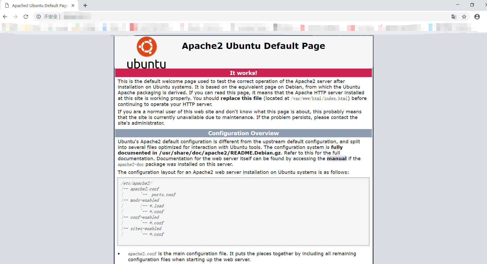
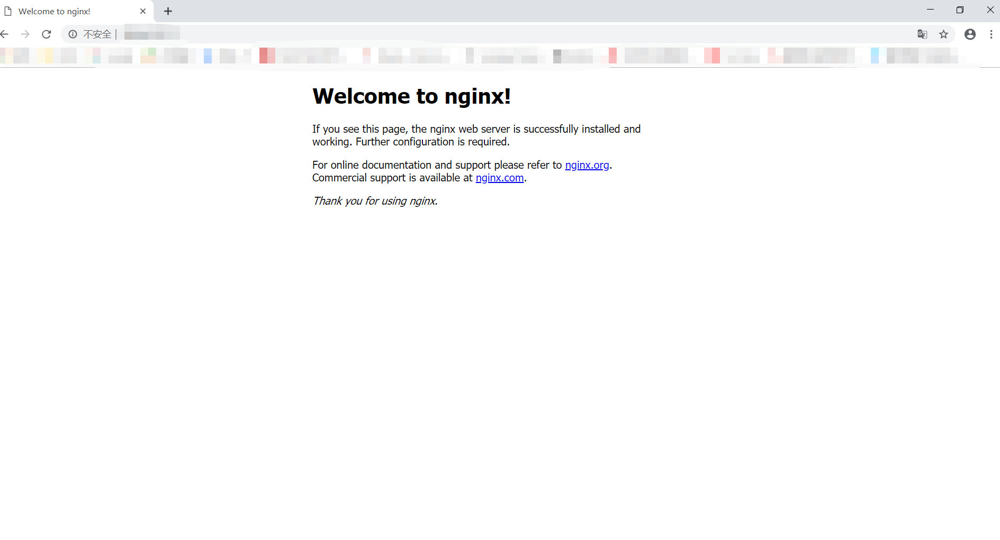
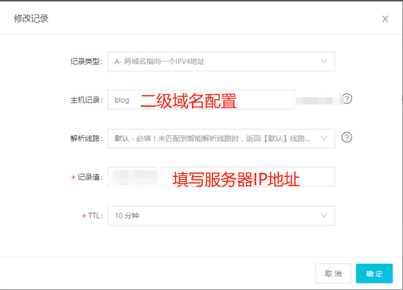
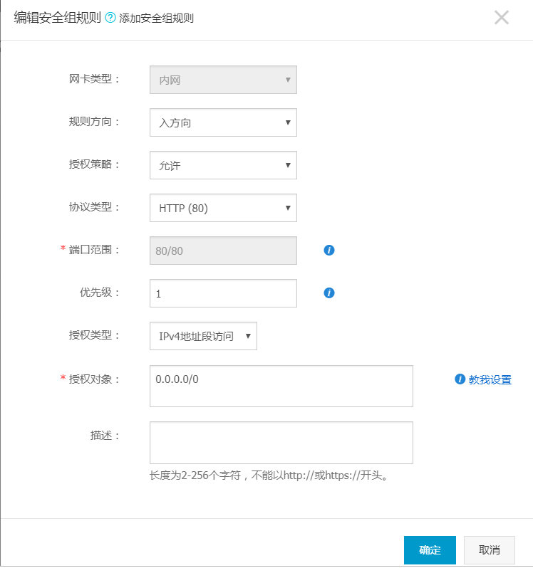
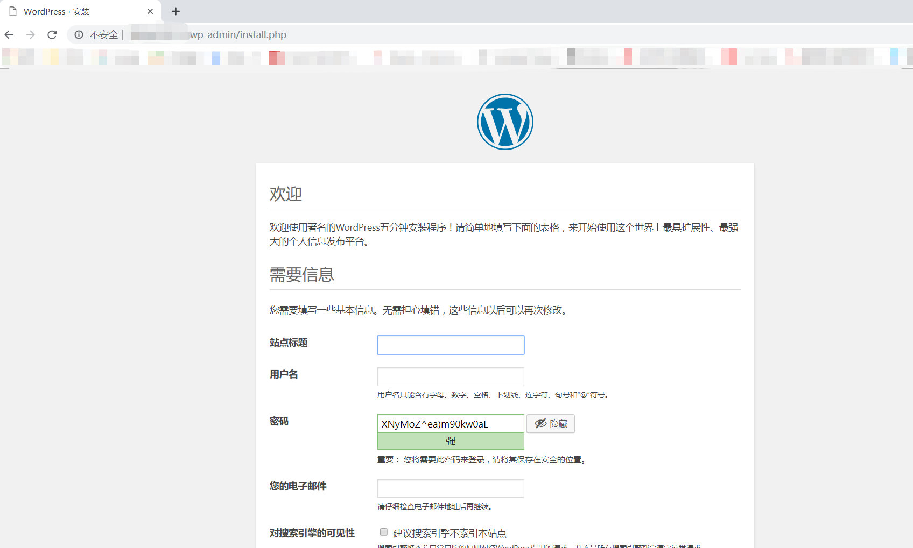

最近想搭建一个个人博客，在网上查询了一番，发现使用WordPress搭建个人博客非常不错，就在阿里云购买了台服务器，选择系统为“Ubuntu 14.04.5 LTS”，并在阿里云买了个域名（域名是为了方便记忆，否则输入ip地址访问网站很不方便），下面就使用Ubuntu系统搭建WordPress个人网站。

如需购买阿里云服务器和域名，可先点击此处领取阿里云优惠券：[最高￥1888云产品通用代金券](https://promotion.aliyun.com/ntms/yunparter/invite.html?userCode=1xljq71y)

### 安装WordPress运行环境
#### 1.安装Mysql数据库
```bash
apt update
apt upgrade
apt install mysql-server
```
查看mysql是否安装成功：
```bash
root@iZ2zeeg42qkecbhciml4pcZ:~# mysql --version
mysql  Ver 14.14 Distrib 5.5.62, for debian-linux-gnu (x86_64) using readline 6.3
```
#### 2.安装PHP

```bash
apt-get install software-properties-common
add-apt-repository ppa:ondrej/php
apt update
apt install php7.2
apt install libapache2-mod-php7.2
apt install php7.2-mysql
apt install php7.2-fpm
```
查看php是否安装成功：
```bash
root@iZ2zeeg42qkecbhciml4pcZ:~# php -v
PHP 7.2.16-1+ubuntu14.04.1+deb.sury.org+1 (cli) (built: Mar  7 2019 20:42:24) ( NTS )
Copyright (c) 1997-2018 The PHP Group
Zend Engine v3.2.0, Copyright (c) 1998-2018 Zend Technologies
    with Zend OPcache v7.2.16-1+ubuntu14.04.1+deb.sury.org+1, Copyright (c) 1999-2018, by Zend Technologies
```
#### 3.安装Nginx
```bash
install nginx
```
查看Nginx是否安装成功：
```bash
root@iZ2zeeg42qkecbhciml4pcZ:~# nginx -v
nginx version: nginx/1.4.6 (Ubuntu)
```
重启Nginx后，在浏览器中输入http://阿里云服务器外网IP地址/
```bash
service nginx stop
service nginx start
```
如果图片显示为下图，说明阿里云服务器自动启动了apache2的服务，apache2和nginx都使用80端口，80端口冲突。
#### [](./16-使用WordPress搭建个人网站/1.jpg "使用WordPress搭建个人网站-1")
关闭apache2的服务
```bash
service apache2 stop
```
重启php7.2-fpm服务和Nginx服务：
```bash
service php7.2-fpm restart
service nginx restart
```
在浏览器中输入http://阿里云服务器外网IP地址/
[](./16-使用WordPress搭建个人网站/2.jpg "使用WordPress搭建个人网站-2")

### 安装WordPress及其配置

#### 1.Mysql创建数据库和用户：
```bash
root@iZ2zeeg42qkecbhciml4pcZ:~# mysql -u root -p
Enter password: 
Welcome to the MySQL monitor.  Commands end with ; or \g.
Your MySQL connection id is 44
Server version: 5.5.62-0ubuntu0.14.04.1 (Ubuntu)

Copyright (c) 2000, 2018, Oracle and/or its affiliates. All rights reserved.

Oracle is a registered trademark of Oracle Corporation and/or its
affiliates. Other names may be trademarks of their respective
owners.

Type 'help;' or '\h' for help. Type '\c' to clear the current input statement.

mysql> create database 数据库名称 character set utf8 collate utf8_general_ci;
Query OK, 1 row affected (0.00 sec)

mysql> grant all on 数据库名称.* to '用户名'@localhost identified by '用户密码';
Query OK, 0 rows affected (0.00 sec)

mysql> FLUSH PRIVILEGES;
Query OK, 0 rows affected (0.00 sec)

mysql> quit
Bye
root@iZ2zeeg42qkecbhciml4pcZ:~#
```
#### 2.下载WordPress并安装：
1. 获取WordPress软件：[点击此处](https://cn.wordpress.org/latest-zh_CN.tar.gz)
2. 将下载的wordpress-5.0.3-zh_CN.tar.gz上传到云服务器上
3. 安装wordPress:
```bash
root@iZ2zeeg42qkecbhciml4pcZ:~# ls
wordpress-5.0.3-zh_CN.tar.gz
root@iZ2zeeg42qkecbhciml4pcZ:~# mv wordpress-5.0.3-zh_CN.tar.gz /var/www/
root@iZ2zeeg42qkecbhciml4pcZ:~# cd /var/www/
root@iZ2zeeg42qkecbhciml4pcZ:/var/www# ls
html  wordpress-5.0.3-zh_CN.tar.gz
root@iZ2zeeg42qkecbhciml4pcZ:/var/www# tar -zxvf wordpress-5.0.3-zh_CN.tar.gz
......
root@iZ2zeeg42qkecbhciml4pcZ:/var/www# ls
html  wordpress  wordpress-5.0.3-zh_CN.tar.gz
root@iZ2zeeg42qkecbhciml4pcZ:/var/www# cd wordpress/
root@iZ2zeeg42qkecbhciml4pcZ:/var/www/wordpress# ls
index.php    readme.html      wp-admin            wp-comments-post.php  wp-content   wp-includes        wp-load.php   wp-mail.php      wp-signup.php     xmlrpc.php
license.txt  wp-activate.php  wp-blog-header.php  wp-config-sample.php  wp-cron.php  wp-links-opml.php  wp-login.php  wp-settings.php  wp-trackback.php
root@iZ2zeeg42qkecbhciml4pcZ:/var/www/wordpress# mv wp-config-sample.php wp-config.php 
```
4. 使用vim命令编辑wp-config.php:

`vim wp-config.php`

修改文件中的数据库配置信息，填写刚才创建的数据库信息：
```bash
/** WordPress数据库的名称 */
define('DB_NAME', '数据库名称');

/** MySQL数据库用户名 */
define('DB_USER', '用户名');

/** MySQL数据库密码 */
define('DB_PASSWORD', '数据库密码');

/**
 * WordPress数据表前缀。
 *
 * 如果您有在同一数据库内安装多个WordPress的需求，请为每个WordPress设置
 * 不同的数据表前缀。前缀名只能为数字、字母加下划线。
 */
$table_prefix  = 'wp_';
```
5. 在阿里云控制台将域名解析到指定的服务器上：

控制台->域名->解析->添加纪录
[](./16-使用WordPress搭建个人网站/3.jpg "使用WordPress搭建个人网站-3")

6. 配置服务安全组策略，将80(http)端口和443(https)端口开放：

控制台->云服务器ECS->网络和安全->安全组->配置规则

配置80端口：
[](./16-使用WordPress搭建个人网站/4.jpg "使用WordPress搭建个人网站-4")
配置443端口：
[](./16-使用WordPress搭建个人网站/5.jpg "使用WordPress搭建个人网站-5")
配置后查看内容：
[](./16-使用WordPress搭建个人网站/6.jpg "使用WordPress搭建个人网站-6")

7. 编辑Nginx配置文件：/etc/nginx/sites-available/default
```bash
client_max_body_size 10m;

server {
    listen 80;
    listen [::]:80;
    server_name localhost;  #你的域名
    root /var/www/wordpress;
    index index.php index.html index.htm index.nginx-debian.html;
    location / {
         # First attempt to serve request as file, then
         # as directory, then fall back to displaying a 404.
         #try_files $uri $uri/ =404;
         try_files $uri $uri/ /index.php?$args;
    }
    location ~ \.php$ {
#       include fastcgi.conf;
include fastcgi_params;
        fastcgi_buffer_size 128k;
        fastcgi_buffers 32 32k;
        #fastcgi_intercept_errors on;
        # With php-fpm (or other unix sockets):
        fastcgi_pass unix:/var/run/php/php7.2-fpm.sock;
        # With php-cgi (or other tcp sockets):
        #fastcgi_pass 127.0.0.1:9000;
    }
}
```
8. 重启Nginx后，在浏览器中输入http://阿里云服务器外网IP地址/
```bash
service nginx stop
service nginx start
```
在浏览器中访问自己的域名，查看是否成功：
[](./16-使用WordPress搭建个人网站/7.jpg "使用WordPress搭建个人网站-7")

到此WordPress就安装成功了，你可以自行配制您的网站信息。
