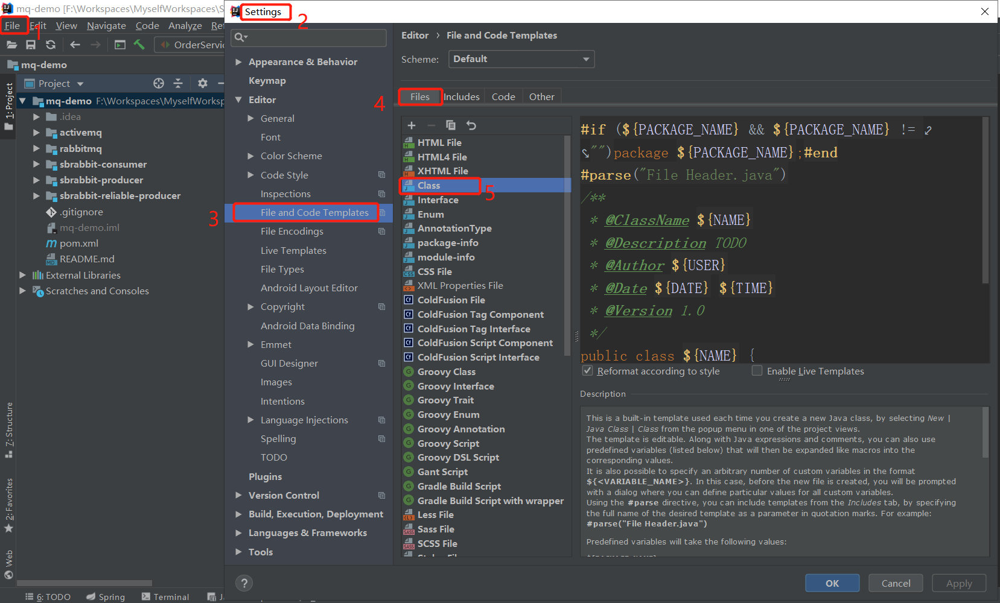
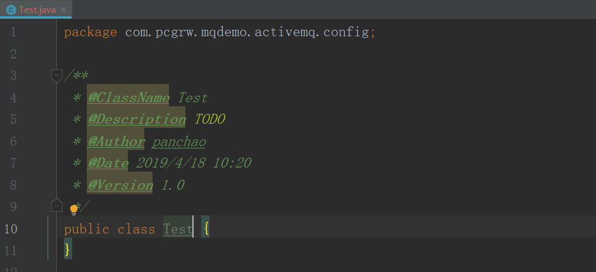
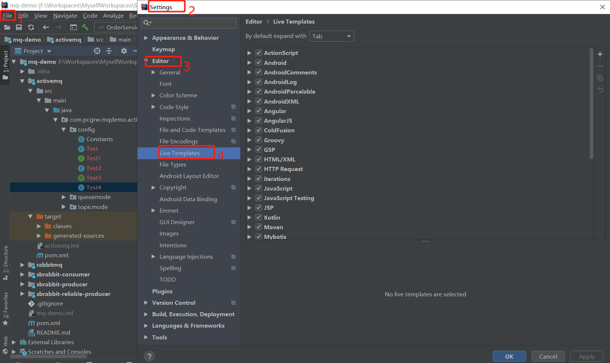
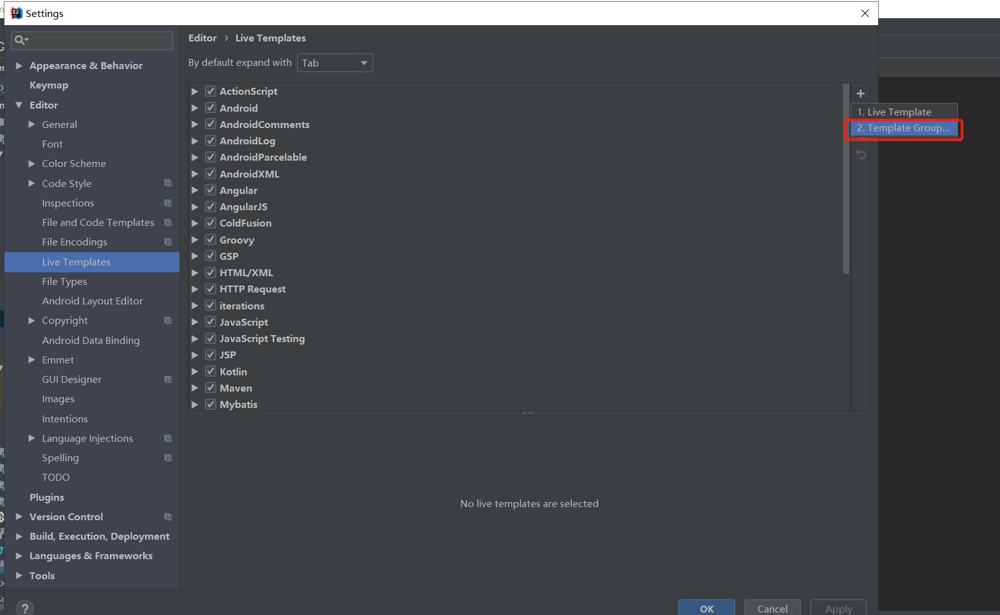
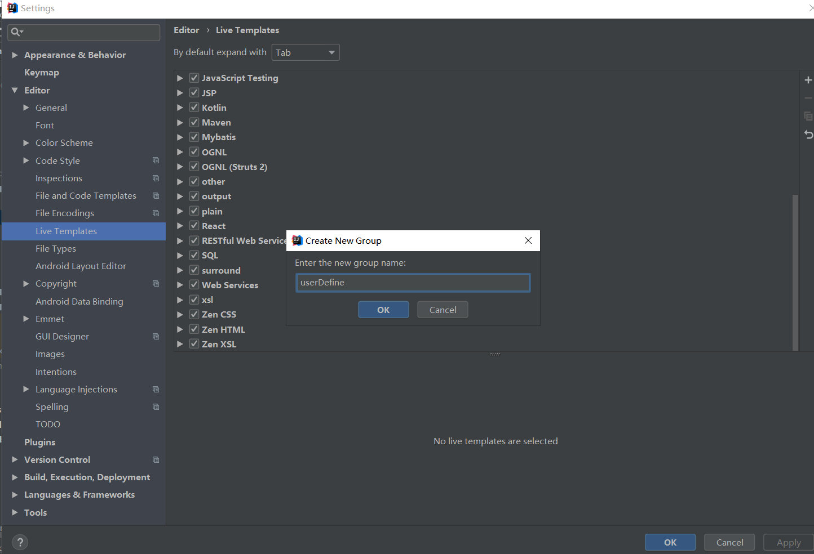
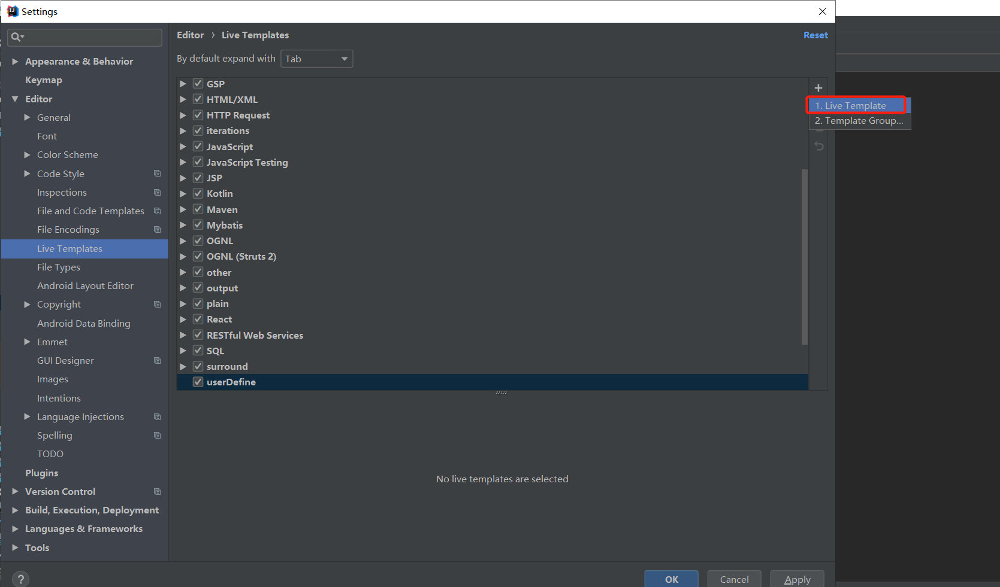
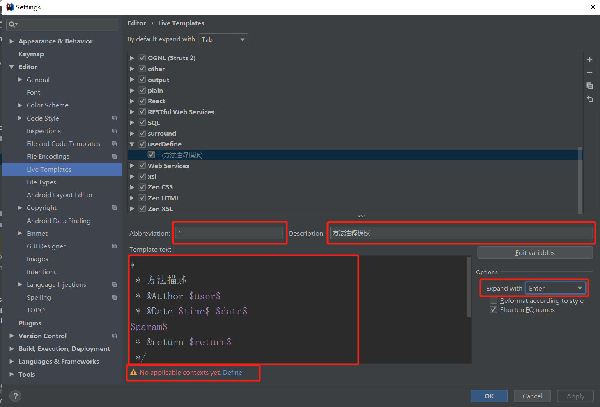
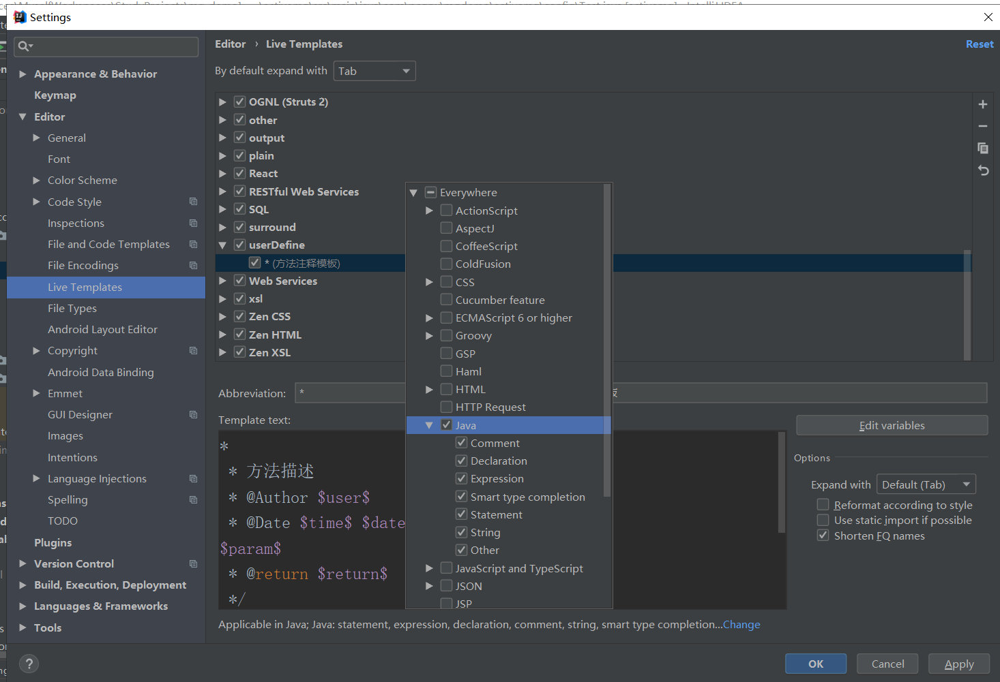
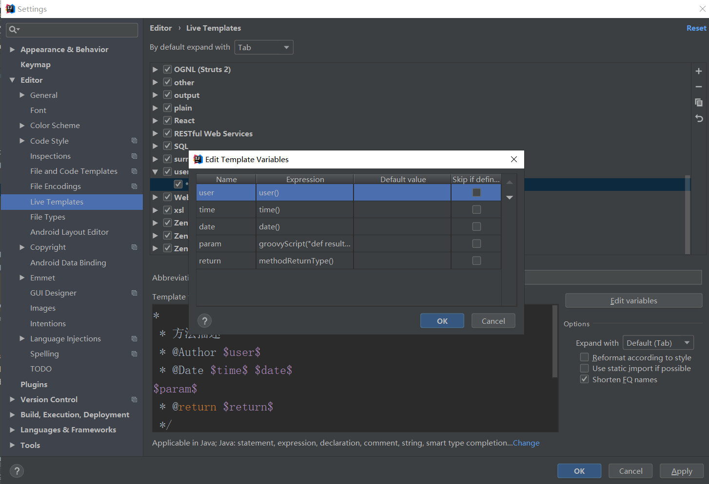
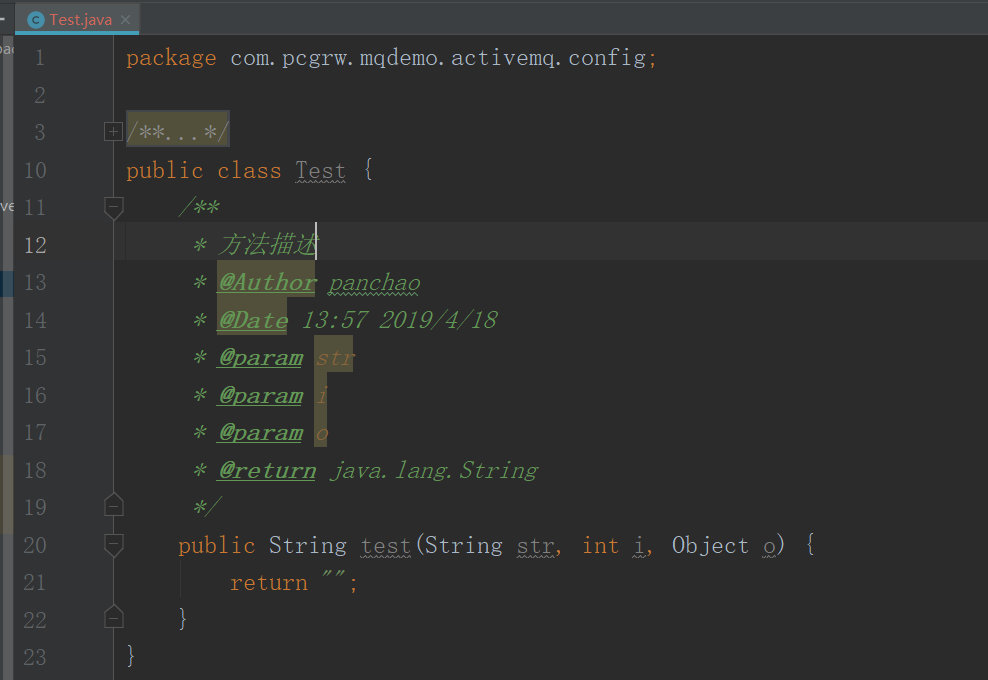

#### 一、设置类注释模板

##### 1.打开IDEA依次点击File-->settings-->Editor-->File and Code Templates-->Files-->Class

[](../image/2019-04-18-IDEA设置类和方法注释模板/1.jpg "IDEA设置类和方法注释模板-1")

##### 2.设置内容如下(可根据需要自行修改):
```java
#if (${PACKAGE_NAME} && ${PACKAGE_NAME} != "")package ${PACKAGE_NAME};#end
#parse("File Header.java")
/**
 * @ClassName ${NAME}
 * @Description TODO
 * @Author ${USER}
 * @Date ${DATE} ${TIME}
 * @Version 1.0
 */
public class ${NAME} {
}
```
- ${NAME}：设置类名，与下面的${NAME}一样才能获取到创建的类名
- TODO：代办事项的标记，一般生成类或方法都需要添加描述
- ${USER}、${DATE}、${TIME}：设置创建类的用户、创建的日期和时间，这些是IDEA内置的方法，还有一些其他的方法在绿色框标注的位置，比如你想添加项目名则可以使用${PROJECT_NAME}
- 1.0：设置版本号，一般新创建的类都是1.0版本，这里写死就可以了

##### 3.创建一个新类，效果如下：

[](../image/2019-04-18-IDEA设置类和方法注释模板/2.jpg "IDEA设置类和方法注释模板-2")

#### 二、设置接口、枚举、注解等注释模板
1. 打开IDEA依次点击File-->settings-->Editor-->File and Code Templates-->Files
选择对应的设置项Interface,Enum,AnnotationType等选项进行设置。
2. 设置方式参考设置类注释模板。

#### 三、设置方法注释模板
IDEA没有智能到自动为我们创建方法注释，这就需要我们手动为方法添加注释，使用Eclipse时我们生成注释的习惯是`/**+Enter`，这里我们也按照这种习惯来设置IDEA的方法注释。

##### 1.打开IDEA依次点击File-->settings-->Editor-->Live Templates

[](../image/2019-04-18-IDEA设置类和方法注释模板/3.jpg "IDEA设置类和方法注释模板-3")

##### 2.新建模板组userDefine(名称可以自定义)

[](../image/2019-04-18-IDEA设置类和方法注释模板/4.jpg "IDEA设置类和方法注释模板-4")

[](../image/2019-04-18-IDEA设置类和方法注释模板/5.jpg "IDEA设置类和方法注释模板-5")

##### 3.在新建的模板组下新建模板

[](../image/2019-04-18-IDEA设置类和方法注释模板/6.jpg "IDEA设置类和方法注释模板-6")

###### 设置内容如下：

Abbreviation中填`*`

Description中填`方法注释模板`

Option中Expand with选择`Enter`

Template text中填：
```java
*
 * 方法描述
 * @Author $user$
 * @Date $time$ $date$
$param$
 * @return $return$
 */
```

[](../image/2019-04-18-IDEA设置类和方法注释模板/7.jpg "IDEA设置类和方法注释模板-7")


点击最下面带有感叹号的`Define`设置此模板用于什么地方：
选择Everywhere-->Java

[](../image/2019-04-18-IDEA设置类和方法注释模板/8.jpg "IDEA设置类和方法注释模板-8")

点击`Edit variables`编辑参数表达式：

[](../image/2019-04-18-IDEA设置类和方法注释模板/9.jpg "IDEA设置类和方法注释模板-9")

- user设置：user()
- time设置：time()
- date设置：date()
- param设置groovy脚本：
```groovy
groovyScript("def result=''; def params=\"${_1}\".replaceAll('[\\\\[|\\\\]|\\\\s]', '').split(',').toList(); for(i = 0; i < params.size(); i++) {result+=' * @param ' + params[i] + ((i < params.size() - 1) ? '\\n':'')}; return result", methodParameters())
```
- return设置：methodReturnType()

##### 4.创建一个新方法，效果如下：

[](../image/2019-04-18-IDEA设置类和方法注释模板/10.jpg "IDEA设置类和方法注释模板-10")