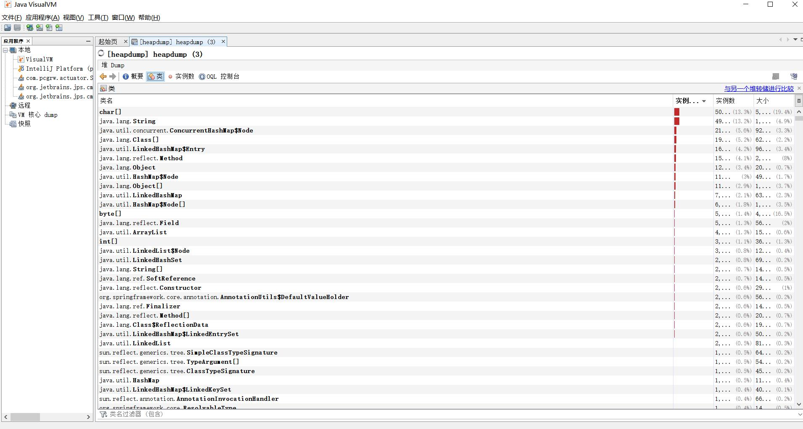

## Actuator 监控

Spring Boot Actuator的关键特性是在应用程序里提供众多Web端点，通过它们了解应用程序
运行时的内部状况。有了Actuator，你可以知道Bean在Spring应用程序上下文里是如何组装在一
起的，掌握应用程序可以获取的环境属性信息，获取运行时度量信息的快照……

## Actuator 的 REST 接口

Actuator提供了13个端点，具体如下表所示。

| HTTP方法 | 路径 | 描述 |
|---|---|---|
| GET | /auditevents | 显示应用暴露的审计事件 (比如认证进入、订单失败) |
| GET | /beans | 描述应用程序上下文里全部的 Bean，以及它们的关系 |
| GET | /conditions | 就是 1.0 的 /autoconfig ，提供一份自动配置生效的条件情况，记录哪些自动配置条件通过了，哪些没通过 |
| GET | /configprops | 描述配置属性(包含默认值)如何注入Bean |
| GET | /env | 获取全部环境属性 |
| GET | /env/{name} | 根据名称获取特定的环境属性值 |
| GET | /health | 报告应用程序的健康指标，这些值由 HealthIndicator 的实现类提供 |
| GET | /heapdump | dump 一份应用的 JVM 堆信息 |
| GET | /httptrace | 显示HTTP足迹，最近100个HTTP request/repsponse |
| GET | /info | 获取应用程序的定制信息，这些信息由info打头的属性提供 |
| GET | /logfile | 返回log file中的内容(如果 logging.file 或者 logging.path 被设置) |
| GET | /loggers | 显示和修改配置的loggers |
| GET | /metrics | 报告各种应用程序度量信息，比如内存用量和HTTP请求计数 |
| GET | /metrics/{name} | 报告指定名称的应用程序度量值 |
| GET | /scheduledtasks | 展示应用中的定时任务信息 |
| GET | /sessions | 如果我们使用了 Spring Session 展示应用中的 HTTP sessions 信息 |
| GET | /shutdown | 关闭应用程序，要求endpoints.shutdown.enabled设置为true |
| GET | /mappings | 描述全部的 URI路径，以及它们和控制器(包含Actuator端点)的映射关系 |
| GET | /threaddump | 获取线程活动的快照 |
| GET | /flyway | 提供一份 Flyway 数据库迁移信息 |
| GET | /liquidbase | 显示Liquibase 数据库迁移的纤细信息 |

**为了保证 actuator 暴露的监控接口的安全性，需要添加安全控制的依赖spring-boot-start-security依赖，访问应用监控端点时，都需要输入验证信息。Security 依赖，可以选择不加，不进行安全管理，但不建议这么做。**

## 快速上手

要启用Actuator的端点，只需在项目中引入Actuator的起步依赖即可。

项目依赖pom.xml:

```xml
<dependencies>
    <dependency>
        <groupId>org.springframework.boot</groupId>
        <artifactId>spring-boot-starter-actuator</artifactId>
    </dependency>
    <dependency>
        <groupId>org.springframework.boot</groupId>
        <artifactId>spring-boot-starter-security</artifactId>
    </dependency>
    <dependency>
        <groupId>org.springframework.boot</groupId>
        <artifactId>spring-boot-starter-web</artifactId>
    </dependency>
</dependencies>
```

配置文件application.yaml：

```yaml
info: #配置项目信息
  app:
    name: spring-boot-actuator
    version: V1.0.0
    test: test
management:
  endpoint:
    shutdown:
      enabled: true #启用接口关闭 Spring Boot
    health:
      show-details: always #health接口展示明细信息
  endpoints:
    web:
      exposure:
        include: "*" #打开所有的监控点
      base-path: /actuator #定制监控点基础路径
  server:
    port: 8099 #设置监控点端口
spring:
  security:
    user:
      name: admin #监控点登录名称
      password: 123456 #监控点登录密码
```

配置完成之后，启动项目就可以继续验证各个监控功能了。

## 命令详解

在 Spring Boot 2.x 中为了安全期间，Actuator 只开放了两个端点 /actuator/health 和 /actuator/info。可以在配置文件中设置打开。

可以打开所有的监控点:
```yaml
management:
  endpoints:
    web:
      exposure:
        include: "*" #打开所有的监控点
```

也可以选择打开部分:

```yaml
management:
  endpoints:
    web:
      exposure:
        include: beans,trace
```

Actuator 默认所有的监控点路径都在`/actuator/*`，当然如果有需要改变这个路径也支持定制。

```yaml
management:
  endpoints:
    web:
      base-path: /manage #定制监控点基础路径
```

设置完重启后，再次访问地址就会变成`/manage/*`

Actuator 几乎监控了应用涉及的方方面面，我们重点讲述一些经常在项目中常用的命令。

### 1.health

health 主要用来检查应用的运行状态，这是我们使用最高频的一个监控点。通常使用此接口提醒我们应用实例的运行状态，以及应用不”健康“的原因，比如数据库连接、磁盘空间不够等。

默认情况下`health`的状态是开放的，添加依赖后启动项目，访问：`http://localhost:8099/actuator/health`即可看到应用的状态。

```json
{
	"status": "UP"
}
```
默认情况下，最终的 Spring Boot 应用的状态是由 HealthAggregator 汇总而成的，汇总的算法是：

1. 设置状态码顺序：`setStatusOrder(Status.DOWN, Status.OUT_OF_SERVICE, Status.UP, Status.UNKNOWN);`。
2. 过滤掉不能识别的状态码。
3. 如果无任何状态码，整个 Spring Boot 应用的状态是 UNKNOWN。
4. 将所有收集到的状态码按照 1 中的顺序排序。
5.  返回有序状态码序列中的第一个状态码，作为整个 Spring Boot 应用的状态。

health 通过合并几个健康指数检查应用的健康情况。Spring Boot Actuator 有几个预定义的健康指标比如`DataSourceHealthIndicator`, `DiskSpaceHealthIndicator`, `MongoHealthIndicator`, `RedisHealthIndicator`等，它使用这些健康指标作为健康检查的一部分。

举个例子，如果你的应用使用 Redis，`RedisHealthindicator`将被当作检查的一部分；如果使用 MongoDB，那么`MongoHealthIndicator`将被当作检查的一部分。

可以在配置文件中关闭特定的健康检查指标，比如关闭 redis 的健康检查：

```yaml
management: 
  health: 
    redise: 
      enabled: false
```

默认，所有的这些健康指标被当作健康检查的一部分。

### 2.info

info 就是我们自己配置在配置文件中以 info 开头的配置信息，比如我们在示例项目中的配置是：

```yaml
info: #配置项目信息
  app:
    name: spring-boot-actuator
    version: V1.0.0
    test: test
```

启动示例项目，访问：`http://localhost:8099/actuator/info`返回部分信息如下：

```json
{
	"app": {
		"name": "spring-boot-actuator",
		"version": "1.0.0",
		"test": "test"
	}
}
```

### 3.beans

根据示例就可以看出，展示了 bean 的别名、类型、是否单例、类的地址、依赖等信息。

启动示例项目，访问：`http://localhost:8099/actuator/beans`返回部分信息如下：

```json
[
  {
    "context": "application:8080:management",
    "parent": "application:8080",
    "beans": [
      {
        "bean": "embeddedServletContainerFactory",
        "aliases": [
          
        ],
        "scope": "singleton",
        "type": "org.springframework.boot.context.embedded.tomcat.TomcatEmbeddedServletContainerFactory",
        "resource": "null",
        "dependencies": [
          
        ]
      },
      {
        "bean": "endpointWebMvcChildContextConfiguration",
        "aliases": [
          
        ],
        "scope": "singleton",
        "type": "org.springframework.boot.actuate.autoconfigure.EndpointWebMvcChildContextConfiguration$$EnhancerBySpringCGLIB$$a4a10f9d",
        "resource": "null",
        "dependencies": [
          
        ]
      }
  }
]
```

### 4.conditions

Spring Boot 的自动配置功能非常便利，但有时候也意味着出问题比较难找出具体的原因。使用 conditions 可以在应用运行时查看代码了某个配置在什么条件下生效，或者某个自动配置为什么没有生效。

启动示例项目，访问：`http://localhost:8099/actuator/conditions`返回部分信息如下：

```json
{
    "positiveMatches": {
     "DevToolsDataSourceAutoConfiguration": {
            "notMatched": [
                {
                    "condition": "DevToolsDataSourceAutoConfiguration.DevToolsDataSourceCondition", 
                    "message": "DevTools DataSource Condition did not find a single DataSource bean"
                }
            ], 
            "matched": [ ]
        }, 
        "RemoteDevToolsAutoConfiguration": {
            "notMatched": [
                {
                    "condition": "OnPropertyCondition", 
                    "message": "@ConditionalOnProperty (spring.devtools.remote.secret) did not find property 'secret'"
                }
            ], 
            "matched": [
                {
                    "condition": "OnClassCondition", 
                    "message": "@ConditionalOnClass found required classes 'javax.servlet.Filter', 'org.springframework.http.server.ServerHttpRequest'; @ConditionalOnMissingClass did not find unwanted class"
                }
            ]
        }
    }
}
```

### 5.heapdump

返回一个 GZip 压缩的 JVM 堆 dump

启动示例项目，访问：`http://localhost:8099/actuator/heapdump`会自动生成一个 Jvm 的堆文件 heapdump，我们可以使用 JDK 自带的 Jvm 监控工具 VisualVM 打开此文件查看内存快照。类似如下图：



### 6.shutdown

开启接口优雅关闭 Spring Boot 应用，要使用这个功能首先需要在配置文件中开启：

```yaml
management:
  endpoint:
    shutdown:
      enabled: true #启用接口关闭 Spring Boot
```

配置完成之后，启动示例项目，使用 curl 模拟 post 请求访问 shutdown 接口。

> shutdown 接口默认只支持 post 请求。

`curl -X POST "http://localhost:8080/actuator/shutdown" `

```json
{
    "message": "Shutting down, bye..."
}
```

此时你会发现应用已经被关闭。

### 7.mappings

描述全部的 URI 路径，以及它们和控制器的映射关系

启动示例项目，访问：`http://localhost:8099/actuator/mappings`返回部分信息如下：

```json
{
  "/**/favicon.ico": {
    "bean": "faviconHandlerMapping"
  },
  "{[/hello]}": {
    "bean": "requestMappingHandlerMapping",
    "method": "public java.lang.String com.neo.controller.HelloController.index()"
  },
  "{[/error]}": {
    "bean": "requestMappingHandlerMapping",
    "method": "public org.springframework.http.ResponseEntity<java.util.Map<java.lang.String, java.lang.Object>> org.springframework.boot.autoconfigure.web.BasicErrorController.error(javax.servlet.http.HttpServletRequest)"
  }
}
```

### 7.threaddump

`/threaddump`接口会生成当前线程活动的快照。这个功能非常好，方便我们在日常定位问题的时候查看线程的情况。 主要展示了线程名、线程ID、线程的状态、是否等待锁资源等信息。

启动示例项目，访问：`http://localhost:8099/actuator/threaddump`返回部分信息如下：

```json
[
  {
    "threadName": "http-nio-8088-exec-6",
    "threadId": 49,
    "blockedTime": -1,
    "blockedCount": 0,
    "waitedTime": -1,
    "waitedCount": 2,
    "lockName": "java.util.concurrent.locks.AbstractQueuedSynchronizer$ConditionObject@1630a501",
    "lockOwnerId": -1,
    "lockOwnerName": null,
    "inNative": false,
    "suspended": false,
    "threadState": "WAITING",
    "stackTrace": [
      {
        "methodName": "park",
        "fileName": "Unsafe.java",
        "lineNumber": -2,
        "className": "sun.misc.Unsafe",
        "nativeMethod": true
      },
      ...
      {
        "methodName": "run",
        "fileName": "TaskThread.java",
        "lineNumber": 61,
        "className": "org.apache.tomcat.util.threads.TaskThread$WrappingRunnable",
        "nativeMethod": false
      }
      ...
    ],
    "lockInfo": {
      "className": "java.util.concurrent.locks.AbstractQueuedSynchronizer$ConditionObject",
      "identityHashCode": 372286721
    }
  }
  ...
]
```

生产出现问题的时候，可以通过应用的线程快照来检测应用正在执行的任务。